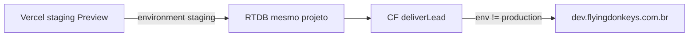

# Ambiente de testes — site novo × EspoCRM DEV

**Status:** runbook documentado (2026-08-21); reorganizado por fases 0–5 (2026-08-27); provisionamento e smokes **ainda não executados**.  
**Objetivo:** validar Fase 4 de atribuição Ads (`modalChannel` → `cCanalCaptura` + pacote UTMs/ValueTrack até Opportunity) **sem** tocar Espo produção nem o site legado.  
**CRM de teste:** `https://dev.flyingdonkeys.com.br`  
**Plano por fases:** [`ATRIBUICAO_ADS_SITE_NOVO_ESPO.md`](ATRIBUICAO_ADS_SITE_NOVO_ESPO.md) §2

---

## Mapa fases ↔ runbook

| Fase | O quê | Seção deste runbook |
|---|---|---|
| **0** | Espo DEV — schema (Enum + pacote Ads/UTM) | §3 |
| **1** | Código local — persistência + captura | Gate manual (DevTools); sem seção dedicada |
| **2** | Staging — RTDB + Espo DEV | §2 (provisionar) + §4.2 + §4.3 |
| **3** | Regressão funil E2E | §4.1 |
| **4** | Google Ads — Final URL suffix | §4.4 |
| **5** | Produção | §5 |

---

## 1. Modelo de isolamento

Não há segundo Firebase. Isolamento do CRM:

| Sinal | Efeito |
|---|---|
| `NEXT_PUBLIC_APP_ENV=staging` (ou `development`) | Site grava RTDB com `environment` ≠ `production` |
| CF `deliverLead` | Usa bloco/proxy **dev** → `dev.flyingdonkeys.com.br` |
| `NEXT_PUBLIC_APP_ENV=production` | → Espo **`flyingdonkeys.com.br`** — **proibido** para smokes deste runbook |

Limites aceitos:

- RTDB compartilhado com prod (registros de teste com `environment=staging` entram nas exclusões da medição).
- Octadesk **sempre produção** — usar telefones/e-mails de teste; HSM pode ser real.

---

## 2. Provisionar staging — Fase 2

1. Branch/Preview Vercel do projeto `imediato-seguros` com o código a testar (após **Fase 1** verde).
2. Env do Preview/staging:
   - `NEXT_PUBLIC_APP_ENV=staging`
   - Firebase Admin apontando para `imediato-seguros-site-novo` (mesmo RTDB)
   - `NEXT_PUBLIC_SITE_URL` = URL de staging
3. Domínio preferido: `staging.novo.segurosimediato.com.br` (DNS → Vercel). Alternativa: URL `*.vercel.app` do Preview.
4. Sanidade: abrir URL → **StagingBanner** visível; `robots` com disallow fora de prod; POST lead de teste → RTDB com `environment: "staging"`.
5. Confirmar no Espo DEV (não prod) a criação do Lead/Opp.

**Antes de qualquer smoke:** no Firebase RTDB, confirmar `environment ∈ {development, staging}`.

**Pré-requisito:** **Fase 0** concluída (campos Espo DEV) e **Fase 1** concluída (código de atribuição).

---

## 3. Pré-requisitos Espo DEV — Fase 0

Em **`dev.flyingdonkeys.com.br`** (Entity Manager), **antes** de Fases 2–4:

1. Enum `cCanalCaptura` em Lead e Opportunity (`formulario` / `whatsapp` / `telefone`) — ver [`CANAL_CAPTURA_ESPO.md`](CANAL_CAPTURA_ESPO.md).
2. Pacote Ads/UTM em Lead **e** Opportunity (inclui **`cUtmCampaignName`**) — ver tabela §3 de [`ATRIBUICAO_ADS_SITE_NOVO_ESPO.md`](ATRIBUICAO_ADS_SITE_NOVO_ESPO.md).
3. Layout “Cotação do Site” + clear cache.

**Gate Fase 0:** campos visíveis no Entity Manager DEV; GET via API confirma atributos.

Credenciais E2E/smoke: `ESPO_BASE_URL=https://dev.flyingdonkeys.com.br` + API key do bloco **dev** (`ESPOCRM_API_CONFIG`). **Nunca** apontar purga E2E para prod.

---

## 4. Matriz de testes

### 4.1 Regressão do funil — Fase 3

- Spec: [`e2e/testes-espocrm.spec.ts`](../e2e/testes-espocrm.spec.ts)
- `SITE_BASE_URL=<URL staging>`
- `ESPO_BASE_URL=https://dev.flyingdonkeys.com.br`
- Piloto: `CASE_FILTER=1`, depois ampliar se verde
- **Gate:** Lead + Opp + funil; cleanup só no DEV

### 4.2 Canal de captura — Fase 2 (smoke B)

| # | Ação no staging | RTDB | Espo DEV |
|---|---|---|---|
| A | Formulário (etapa estável) | `captureChannel=lead_form` | `cCanalCaptura=formulario` |
| B | Modal WhatsApp | `contact_modal` + `modalChannel=whatsapp` | `whatsapp` |
| C | Modal telefone | `modalChannel=phone` | `telefone` |

Telefones/e-mails de teste dedicados; purgar Lead/Opp no DEV após.

### 4.3 Atribuição / persistência — Fase 2 (smoke D)

1. Abrir staging com query sintética completa (UTMs + ValueTrack + `gclid`/`gbraid` de teste + **`campaign_name=Nome Campanha Teste`**).
2. Navegar para outra página **sem** query.
3. Submeter form ou modal.
4. Conferir RTDB `data.utm` com click IDs/UTMs e `campaign_name` preservados.
5. Conferir Lead **e** Opportunity no Espo DEV: `cUtmCampaign` (ID) + **`cUtmCampaignName`** (nome literal) e demais campos mapeados.

Resiliência: com Enum/campo ausente, criação Lead/Opp e funil continuam OK; só o PUT best-effort do campo faltante falha em log.

**Gate Fase 2:** RTDB + Lead + Opp DEV com pacote; smokes 4.2 e 4.3 verdes.

### 4.4 Google Ads — Fase 4

**Pré-requisito:** Fases 0–3 verdes.

Após configurar Final URL suffix na campanha `24095000558` ([`ATRIBUICAO_ADS_SITE_NOVO_ESPO.md`](ATRIBUICAO_ADS_SITE_NOVO_ESPO.md) §6):

- Preview de URL do anúncio com sufixo resolvido.
- URL copiada do preview → colar no **staging** → repetir smoke 4.3.
- Tráfego real Ads vai para prod; leads prod pós-suffix validados na Fase 5.

**Gate Fase 4:** suffix ativo no preview; atribuição fecha no Espo DEV via URL do Ads.

---

## 5. Gate para produção — Fase 5

**Pré-requisito:** Fases 0–4 verdes.

1. Espelhar campos/Enum no Espo prod (`flyingdonkeys.com.br`).
2. Deploy Vercel production + CF já validada na Fase 2.
3. Smoke mínimo em prod com marcadores de teste + exclusão na medição.
4. Monitorar 48h: RTDB prod, Opp prod, conversões Ads braço Exp.
5. Reavaliar venda/campanha via `scripts/espo-ops` e placar comercial ([`EXPERIMENTO_PLACAR_COMERCIAL_ESPO.md`](EXPERIMENTO_PLACAR_COMERCIAL_ESPO.md)).

Critérios detalhados: [`ATRIBUICAO_ADS_SITE_NOVO_ESPO.md`](ATRIBUICAO_ADS_SITE_NOVO_ESPO.md) §9.

---

## 6. O que não fazer

- Smoke em `novo.segurosimediato.com.br` com `APP_ENV=production` para testes de CRM.
- `ESPO_BASE_URL` / purga apontando para `flyingdonkeys.com.br`.
- Criar campos Enum primeiro em produção (pular Fase 0).
- Alterar campanha Controle `21287198336` ou o site legado.
- Assumir que Octadesk tem sandbox.
- Aplicar Final URL suffix (Fase 4) antes de Fases 0–3 verdes.

---

## 7. Referências

- [`ATRIBUICAO_ADS_SITE_NOVO_ESPO.md`](ATRIBUICAO_ADS_SITE_NOVO_ESPO.md) — plano por fases §2
- [`CANAL_CAPTURA_ESPO.md`](CANAL_CAPTURA_ESPO.md)
- [`ARQUITETURA_LEADS_FIREBASE_CLOUD_FUNCTION.md`](ARQUITETURA_LEADS_FIREBASE_CLOUD_FUNCTION.md)
- [`FASE_A_GTM_ESPOCRM_OPS.md`](FASE_A_GTM_ESPOCRM_OPS.md)
- [`firebase/README.md`](../firebase/README.md)
