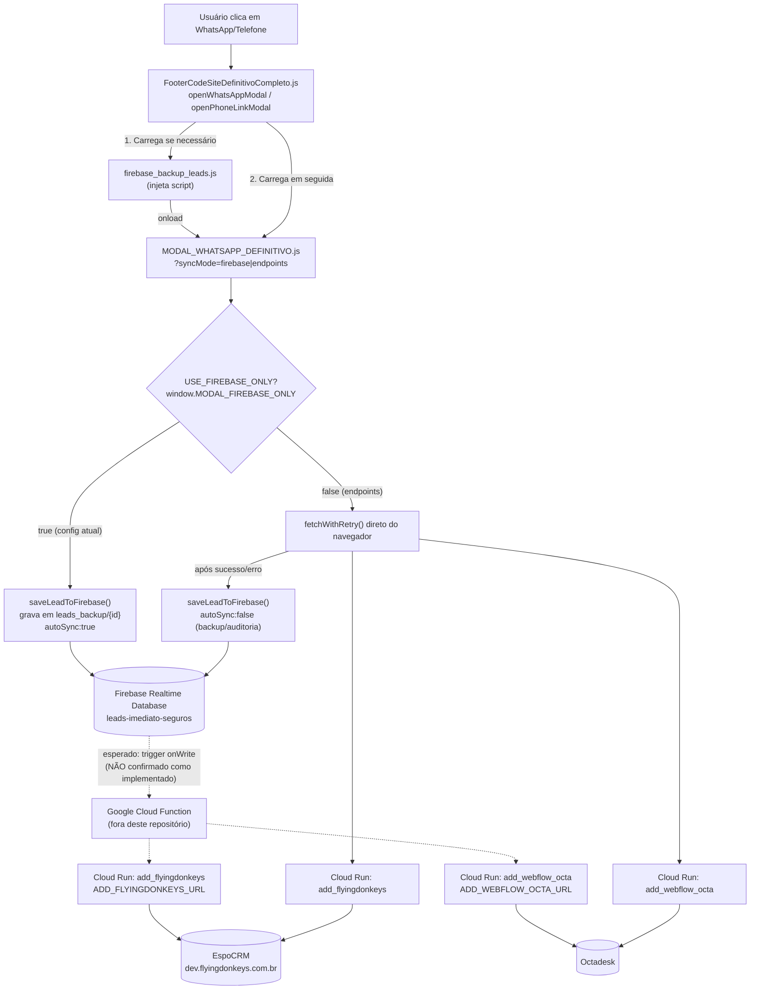

# Análise — Chamadas a EspoCRM e Octadesk via Firebase, Cloud Functions e Cloud Run

## Objetivo e arquivos analisados

Este documento explica, com base em leitura de código-fonte, como o site legado (Webflow) envia leads para o EspoCRM e para o Octadesk, e qual o papel do Firebase, do Google Cloud Functions e do Google Cloud Run nesse fluxo.

Arquivos solicitados para esta análise:

- `WEBFLOW-SEGUROSIMEDIATO/02-DEVELOPMENT/webflow_injection_limpo.js` (160 KB)
- `WEBFLOW-SEGUROSIMEDIATO/02-DEVELOPMENT/FooterCodeSiteDefinitivoCompleto.js` (183 KB)

Para reconstruir a cadeia completa (esses dois arquivos **carregam outros scripts dinamicamente**, e é neles que as chamadas de fato acontecem), também foi necessário ler:

- `WEBFLOW-SEGUROSIMEDIATO/02-DEVELOPMENT/firebase_backup_leads.js`
- `WEBFLOW-SEGUROSIMEDIATO/02-DEVELOPMENT/MODAL_WHATSAPP_DEFINITIVO.js`
- Referência cruzada com `docs/WEBFLOW_CUSTOM_CODE_DEV.md` (Head Code real do Webflow DEV, já capturado neste projeto) para confirmar a configuração ativa.

## Resumo executivo

1. **`webflow_injection_limpo.js` não participa deste fluxo.** É o script exclusivo do formulário principal de cotação (RPA — 16 fases, validação de CPF/placa/CEP, `RPA_API_BASE_URL`). Não há nenhuma referência a EspoCRM, Octadesk ou Firebase nesse arquivo.
2. **`FooterCodeSiteDefinitivoCompleto.js` é só o orquestrador.** Ele valida se as URLs de EspoCRM/Octadesk existem (`window.ADD_FLYINGDONKEYS_URL`, `window.ADD_WEBFLOW_OCTA_URL`) e, quando o usuário clica em WhatsApp/telefone, carrega dinamicamente **dois outros scripts** — `firebase_backup_leads.js` e `MODAL_WHATSAPP_DEFINITIVO.js` (ou `MODAL_PHONE_LINK_DEFINITIVO.js`) — mas **não faz, ele mesmo, nenhuma chamada de rede a EspoCRM/Octadesk/Firebase**.
3. **As chamadas reais** (o `fetch()` para EspoCRM/Octadesk e a escrita no Firebase) estão dentro do `MODAL_WHATSAPP_DEFINITIVO.js`, que é injetado pelo FooterCode.
4. **A configuração atual (`window.MODAL_FIREBASE_ONLY = true`, confirmada no Head Code do Webflow DEV) ativa o modo "Firebase-Only"**: o navegador **não chama o Cloud Run diretamente**; ele apenas grava o lead no Firebase Realtime Database e confia que uma **Cloud Function no backend** fará a entrega a EspoCRM/Octadesk de forma assíncrona.
5. **Achado relevante:** o próprio código do `firebase_backup_leads.js` (versão carregada atualmente) documenta que essa Cloud Function/listener **ainda não foi implementada** ("Fase 1: apenas registro... funções de processamento automático serão implementadas em fase futura"), o que é uma contradição com o comentário no modal ("o Firebase Cloud Function já processa tudo automaticamente"). Ver seção de riscos.

## Diagrama do fluxo completo



## Análise arquivo por arquivo

### 1. `webflow_injection_limpo.js` — não relacionado

Cabeçalho do próprio arquivo já declara seu escopo: "Integração RPA" e "SpinnerTimer integrado com ciclo de vida do RPA". Todo o conteúdo gira em torno de:

- `RPA_API_BASE_URL` e a classe `ProgressModalRPA` (polling em `/api/rpa/progress/{sessionId}`).
- Validação de CEP (ViaCEP), placa e telefone.
- Captura e submissão do formulário principal (`submit_button_auto`) para o motor de RPA (cotação automatizada nas seguradoras).

Busca por `ESPOCRM`, `FLYINGDONKEYS`, `OCTA`, `firebase`, `cloudfunctions`, `run.app` neste arquivo: **zero ocorrências**. Ele é o script do fluxo de **cotação automatizada**, não do fluxo de **captura de lead via WhatsApp/telefone**.

### 2. `FooterCodeSiteDefinitivoCompleto.js` — orquestração, sem chamadas diretas

Duas funções relevantes:

```1008:1012:FooterCodeSiteDefinitivoCompleto.js
if (typeof window.ADD_FLYINGDONKEYS_URL === 'undefined' || !window.ADD_FLYINGDONKEYS_URL) {
    throw new Error('[CONFIG] ERRO CRÍTICO: ADD_FLYINGDONKEYS_URL não está definido...');
}
if (typeof window.ADD_WEBFLOW_OCTA_URL === 'undefined' || !window.ADD_WEBFLOW_OCTA_URL) {
```

Isso é só validação "fail-fast" de configuração (aborta se as URLs não vierem do `config_env.js`). A função que efetivamente prepara o carregamento do modal:

```2912:2954:FooterCodeSiteDefinitivoCompleto.js
// FASE 1: Carregar Firebase Backup Leads ANTES do modal
if (!window.firebaseBackupLeadsLoaded) {
  const firebaseScript = document.createElement('script');
  firebaseScript.src = window.APP_BASE_URL + '/firebase_backup_leads.js?...';
  firebaseScript.onload = function() { ...; loadModalScript(); };
  ...
}
...
function loadModalScript() {
  const firebaseOnly = window.MODAL_FIREBASE_ONLY || false;
  const syncMode = firebaseOnly ? 'firebase' : 'endpoints';
  script.src = window.APP_BASE_URL + `/MODAL_WHATSAPP_DEFINITIVO.js?v=24&syncMode=${syncMode}&force=...`;
  ...
}
```

Ou seja, o FooterCode:

1. Garante que `firebase_backup_leads.js` seja carregado **antes** do modal (define funções globais como `window.saveLeadToFirebase`).
2. Só então injeta `MODAL_WHATSAPP_DEFINITIVO.js` (ou `MODAL_PHONE_LINK_DEFINITIVO.js`, mesma lógica, linha ~3060-3113), passando o modo de sincronização (`syncMode=firebase` ou `syncMode=endpoints`) via query string, de acordo com a flag global `window.MODAL_FIREBASE_ONLY`.

**Nenhum `fetch()` para EspoCRM/Octadesk/Firebase existe neste arquivo** — ele delega 100% dessa responsabilidade aos scripts que carrega.

## A cadeia real de chamadas (nos scripts carregados dinamicamente)

### Google Cloud Run — chamada direta (modo `endpoints`)

Dentro de `MODAL_WHATSAPP_DEFINITIVO.js`, a função `getEndpointUrl()` resolve a URL real:

```189:213:MODAL_WHATSAPP_DEFINITIVO.js
function getEndpointUrl(endpoint) {
  if (endpoint === 'octadesk' && window.ADD_WEBFLOW_OCTA_URL) {
    return window.ADD_WEBFLOW_OCTA_URL;
  }
  if (endpoint === 'flyingdonkeys' && window.ADD_FLYINGDONKEYS_URL) {
    return window.ADD_FLYINGDONKEYS_URL;
  }
  ...
}
```

`ADD_FLYINGDONKEYS_URL` e `ADD_WEBFLOW_OCTA_URL` apontam para serviços **Google Cloud Run** (confirmado em investigações anteriores deste projeto: `dev.flyingdonkeys.com.br` para EspoCRM/dev; produção do Octadesk). A chamada em si (função `registrarPrimeiroContatoEspoCRM`, primeiro contato):

```1153:1216:MODAL_WHATSAPP_DEFINITIVO.js
const endpointUrl = getEndpointUrl('flyingdonkeys');
...
const result = await fetchWithRetry(endpointUrl, {
  method: 'POST',
  headers: { 'Content-Type': 'application/json', 'User-Agent': 'Modal-WhatsApp-v2.0' },
  body: jsonBody
}, 2, 1000);
```

`fetchWithRetry` (linha 592) faz até 2 retentativas, com timeout de 60s por tentativa (`AbortController`). O payload do primeiro contato (`registrarPrimeiroContatoEspoCRM`):

```json
{
  "data": {
    "DDD-CELULAR": "11", "CELULAR": "999999999", "GCLID_FLD": "...",
    "NOME": "11-999999999-NOVO CLIENTE WHATSAPP",
    "CPF": "", "CEP": "", "PLACA": "",
    "Email": "11999999999@imediatoseguros.com.br",
    "produto": "seguro-auto", "landing_url": "...",
    "utm_source": "...", "utm_campaign": "..."
  },
  "d": "2026-...ISO...", "name": "Modal WhatsApp - Primeiro Contato (V2)"
}
```

Depois que o usuário completa o formulário do modal, `atualizarLeadEspoCRM()` reenvia com os dados completos (CPF, CEP, placa, e-mail real etc.), usando o mesmo `fetchWithRetry` + `getEndpointUrl('flyingdonkeys')`.

Para o Octadesk, a lógica é espelhada em `enviarMensagemInicialOctadesk()` / `enviarMensagemOctadesk()`, usando `getEndpointUrl('octadesk')` → `window.ADD_WEBFLOW_OCTA_URL`, mesmo padrão de `fetch` POST JSON com retry.

Em caso de sucesso, ainda é disparado (não bloqueante) um `sendAdminEmailNotification()` para `window.SEND_EMAIL_NOTIFICATION_URL` — um terceiro Cloud Run que envia e-mail de notificação interna para a equipe.

### Firebase Realtime Database — registro paralelo (backup) ou fonte única (Firebase-Only)

`firebase_backup_leads.js` inicializa o Firebase via CDN (`firebasejs/10.7.1`, projeto `leads-imediato-seguros`, banco `https://leads-imediato-seguros-default-rtdb.firebaseio.com`) e expõe globalmente `window.saveLeadToFirebase(leadData, options)`.

Toda vez que o modal tenta enviar um lead — **independente do modo** —, ele também grava uma cópia em `leads_backup/{timestamp}` no Firebase:

```263:284:firebase_backup_leads.js
const leadRecord = {
  data: leadData, timestamp: ..., status: 'pending', synced: false,
  source: source, autoSync: autoSync, attempts: 0, environment: environment,
  espocrm_sent: false, espocrm_sent_at: null, espocrm_attempts: 0, espocrm_last_error: null,
  octadesk_sent: false, octadesk_sent_at: null, octadesk_attempts: 0, octadesk_last_error: null
};
```

A flag `autoSync` é o que diferencia os dois papéis do Firebase:

- **`autoSync: false`** — usada quando o `fetch` direto ao Cloud Run **já teve sucesso**. O registro no Firebase é só uma cópia de auditoria/backup.
- **`autoSync: true`** — usada quando o `fetch` direto **falhou**, OU quando o modal está no modo Firebase-Only (nesse modo, o Firebase é a **única** gravação feita pelo navegador). O comentário no código é explícito sobre a intenção: *"Ativar autoSync para Cloud Function processar como backup"* / *"Cloud Function já processa tudo automaticamente (EspoCRM + Octadesk)"*.

### Google Cloud Functions — o elo "esperado", mas não confirmado como ativo

É aqui que está o ponto mais importante da análise. Quando `window.MODAL_FIREBASE_ONLY = true` (modo Firebase-Only), o código do modal **não chama o Cloud Run diretamente** — ele apenas grava no Firebase com `autoSync:true` e assume que uma Cloud Function no backend do Google Cloud vai:

1. Ser disparada por um *trigger* de escrita no Realtime Database (`leads_backup/{id}`), ou rodar em polling/schedule.
2. Ler o registro pendente e chamar os mesmos endpoints Cloud Run (`ADD_FLYINGDONKEYS_URL`, `ADD_WEBFLOW_OCTA_URL`) a partir do servidor.
3. Atualizar `espocrm_sent`/`octadesk_sent` no próprio Firebase.

**Confirmação da configuração ativa:** o Head Code do Webflow DEV (capturado em `docs/WEBFLOW_CUSTOM_CODE_DEV.md`) contém:

```209:213:docs/WEBFLOW_CUSTOM_CODE_DEV.md
<script>
    // PROJETO: Firebase-Only Modal
    // Ativar modo Firebase-Only para usar apenas Firebase (sem chamadas diretas aos endpoints)
    window.MODAL_FIREBASE_ONLY = true;
</script>
```

Ou seja, **o modo ativo é Firebase-Only** — o navegador não fala com o Cloud Run para o modal WhatsApp/telefone; ele depende inteiramente dessa Cloud Function.

**Porém**, o próprio `firebase_backup_leads.js` (versão atualmente referenciada e lida nesta análise, datada de 29/11–01/12/2025, v1.1.0) documenta no cabeçalho:

```12:22:firebase_backup_leads.js
* FASE 1: Apenas registro de leads (sem listeners automáticos)
* - saveLeadToFirebase() - Registro de todos os leads
* ...
* FUNÇÕES REMOVIDAS (serão implementadas em fase futura):
* - setupFirebaseListener() - Listener automático
* - processNewLeadFromFirebase() - Processamento automático
* - syncAllPendingLeadsFromFirebase() - Sincronização automática
* - initFirebaseBackup() - Inicialização automática
```

Isso **não prova** que a Cloud Function não existe (ela pode estar implantada separadamente no Google Cloud Console/Firebase, fora deste repositório de arquivos front-end — nenhum diretório `functions/` ou código-fonte de Cloud Functions foi encontrado nas pastas fornecidas). Mas é uma **contradição direta** com o comentário otimista dentro de `MODAL_WHATSAPP_DEFINITIVO.js` ("o Firebase Cloud Function já processa tudo automaticamente"), e não foi possível, só com os dois arquivos e os scripts que eles carregam, confirmar que essa Cloud Function está de fato implantada e funcionando.

## Os dois "modos" (`syncMode`) e o que está realmente ativo

| Modo (`syncMode`) | Quem chama o Cloud Run? | Papel do Firebase | Confirmado como ativo? |
|---|---|---|---|
| `endpoints` (padrão do código se a flag não existir) | O navegador, direto (`fetchWithRetry`) | Backup/auditoria após a chamada (`autoSync:false` em sucesso, `true` em falha) | Seria o modo caso `MODAL_FIREBASE_ONLY` não estivesse definido |
| `firebase` (Firebase-Only) | Ninguém no navegador — depende de uma Cloud Function no backend | Única gravação feita pelo cliente (`autoSync:true`) | **É o modo configurado no Head Code atual** (`window.MODAL_FIREBASE_ONLY = true`), mas a entrega final a EspoCRM/Octadesk depende de uma Cloud Function cuja implementação não foi localizada/confirmada no código analisado |

Há ainda uma inconsistência histórica registrada na documentação do próprio projeto legado (`05-DOCUMENTATION/ANALISE_FOOTERCODE_FIREBASE_SYNCMODE_20260309.md`): por um tempo, o modal de **telefone** não recebia o parâmetro `syncMode` do FooterCode (ficava sempre em `endpoints`) enquanto o modal de **WhatsApp** já usava `firebase`. Isso foi corrigido em versões posteriores do FooterCode (o trecho lido nesta análise, linhas 3060-3113, já repassa `syncMode` também para o modal de telefone).

## Efeitos colaterais do fluxo

- **E-mail interno:** após sucesso do envio a EspoCRM ou Octadesk, `sendAdminEmailNotification()` dispara (não bloqueante) uma chamada a `window.SEND_EMAIL_NOTIFICATION_URL` (outro serviço Cloud Run) para notificar a equipe comercial por e-mail.
- **Estado local:** o modal salva `lead_id`/`opportunity_id`/`firebase_lead_id` em `localStorage` (`whatsapp_modal_lead_state`) para não recriar o mesmo lead em interações subsequentes do mesmo usuário.
- **GTM/eventos:** cada tentativa e resultado dispara `logEvent(...)` (ex.: `whatsapp_modal_espocrm_initial_success`) para o data layer.

## Comparação com a nova implementação (Next.js)

A nova implementação (`lib/leads/espocrm.ts`, `lib/leads/octadesk.ts`, `lib/leads/webhook.ts`) já adota uma abordagem equivalente ao modo **`endpoints`** do legado — chamada direta, em paralelo, aos dois destinos, a partir do servidor (não do navegador), com retries e sem depender de uma Cloud Function externa não confirmada. Isso é, na prática, **mais robusto** do que o modo Firebase-Only atual do site legado, cujo elo de entrega final (a Cloud Function) não pôde ser confirmado como implementado nesta análise. O Firebase, no site novo, não é usado como camada de persistência de leads — esse papel é feito pelo `leadStore` (arquivo local, com o bug de filesystem read-only no Vercel já diagnosticado em conversa anterior e com correção pendente).

## Limitações desta análise

- Não houve acesso ao Google Cloud Console / Firebase Console para confirmar diretamente se existe uma Cloud Function com trigger em `leads_backup/*` e se ela está ativa — a conclusão sobre esse ponto é inferida exclusivamente da leitura de comentários conflitantes no código-fonte front-end.
- Não foi encontrado, nas pastas fornecidas (`imediatoseguros-rpa-playwright/...`), um diretório com código-fonte de Cloud Functions (ex.: `functions/index.js`) que pudesse confirmar ou refutar a implementação do lado servidor.
- O payload exato de `atualizarLeadEspoCRM()` (dados completos, pós-preenchimento do modal) e de `enviarMensagemOctadesk()` (mensagem completa) não foi reproduzido linha a linha neste documento — a estrutura é a mesma do primeiro contato, apenas com mais campos preenchidos (CPF, CEP, placa, e-mail real). Se for necessário o payload byte-a-byte, uma leitura adicional das linhas 1464-1863 e 2200-2350 de `MODAL_WHATSAPP_DEFINITIVO.js` resolveria.
