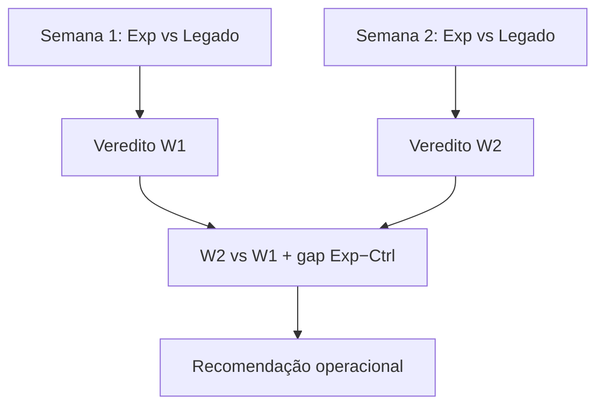

# Análise comparativa do experimento — 10–14/08 vs 17–21/08/2026

**Status:** FINAL para as duas janelas analisadas  
**Gerado em:** 2026-08-22  
**Conta Ads:** `994-791-8772`  
**Controle:** campanha `21287198336` (site legado)  
**Exp:** campanha `24095000558` (`novo.segurosimediato.com.br`)  
**Operação:** somente leitura. Nenhuma campanha, anúncio, GTM, GA4 ou ambiente foi alterado durante a coleta.

Metodologia de referência: [`ANALISE_EXPERIMENTO_5DU_2026-08-10-14.md`](ANALISE_EXPERIMENTO_5DU_2026-08-10-14.md).  
Relatório anterior (W1 isolada): mesmo arquivo.

---

## Abordagem analítica

Este relatório segue **dois passos**, nesta ordem:

1. **Comparação intra-semana (Exp vs Legado):** em cada janela de 5 dias úteis, confrontar o braço **Exp** (`novo.segurosimediato.com.br`) com o braço **Controle** (site legado) nas mesmas dimensões — split, Google Ads, conversões por action, GA4 e Firebase (placar principal: gclids únicos / clique e CPA por gclid). Cada semana recebe um **veredito próprio** antes de qualquer leitura temporal.
2. **Comparação inter-semana (W2 vs W1):** só depois de fechar os dois confrontos Exp vs Legado, analisar tendências semana a semana (Ctrl W2/W1, Exp W2/W1 e evolução do gap Exp−Ctrl).

**Placar principal em ambos os passos:** gclids únicos Firebase ÷ cliques Ads (captura operacional). **Placar decisório (evolução):** vendas Espo `stage = Vendido`, comissão Σ (`amount`) e R$/clique — ver [`EXPERIMENTO_PLACAR_COMERCIAL_ESPO.md`](EXPERIMENTO_PLACAR_COMERCIAL_ESPO.md).

---

## 1. Resumo executivo

**Veredito (visão geral):** a semana **17–21/08 (W2)** trouxe **muito mais volume** para ambos os braços e **estreitou drasticamente** a vantagem do site novo sobre o legado no placar principal. Em **W1**, o confronto Exp vs Legado favoreceu claramente o site novo; em **W2**, o mesmo confronto ficou **em paridade** na captura identificada (~16,7% vs ~16,4% gclid/clique), embora o Exp **mantenha** engajamento GA4 alto (~44% vs ~10% no legado).

Principais evidências:

- **Split efetivo melhorou:** share de cliques Exp subiu de **24,9%** (W1) para **38,4%** (W2) — mais próximo do nominal 50/50.
- **Placar principal (Firebase):** Exp W2 **114 gclids únicos / 684 cliques = 16,67%**; Controle W2 **180 / 1098 = 16,39%**. Gap Exp−Ctrl **quase zerado** (vs +162% relativo em W1 na análise publicada).
- **CPA por gclid único:** Exp W2 **R$ 29,07**; Controle W2 **R$ 27,68** — paridade; em W1 o Exp era claramente mais barato (R$ 23,35 vs R$ 58,85).
- **Google Ads agregado:** Exp W2 CVR **22,1%** vs Controle **17,3%** (ainda favorável ao Exp, mas menos extremo que W1); CPA Ads Exp W2 **R$ 21,92** vs Controle **R$ 26,29**.
- **GA4:** taxa de engajamento Exp no domínio novo **43,4%** (W2) vs legado **10,2%** — vantagem de qualidade de visita **persiste**.
- **Offline (`SegurosImediatoOffline`):** W2 Exp **2** vs Controle **6** (amostra pequena; W1 foi 7 vs 8).

**Recomendação:** o experimento **deve continuar** por mais janelas; **não promover** o site novo com base só em lead rate W2. Decisão de promoção deve seguir o **placar comercial** (vendas `Vendido` + Valor Comissão as-of cada emissão), reexecutando W1/W2/W3… a cada relatório — ver [`EXPERIMENTO_PLACAR_COMERCIAL_ESPO.md`](EXPERIMENTO_PLACAR_COMERCIAL_ESPO.md). W1/W2 ainda **imaturas** comercialmente na data deste relatório.

---

## 2. Pré-flight (snapshot 2026-08-22)

| Checagem | Resultado |
|---|---|
| Campanhas Controle + Exp | `ENABLED` (primary `LIMITED` — `MISSING_LEAD_FORM_EXTENSION`, não reprovação) |
| RSAs Exp | **21 APPROVED**, 0 DISAPPROVED, 14 ENABLED |
| Experimento `10061298880` | Braços 50/50 Controle/Exp confirmados na API |
| GTM Live | **v47** — hostname RegEx `comparaseguroonline.com.br\|novo.segurosimediato.com.br`; Ads `form_initial_contact` ativo; tags modais antigas pausadas |

---

## 3. Semana 1 (10–14/08): Exp vs Legado

Confronto **intra-semana** — site novo (Exp) contra site legado (Controle) na mesma janela. Detalhe ampliado: [`ANALISE_EXPERIMENTO_5DU_2026-08-10-14.md`](ANALISE_EXPERIMENTO_5DU_2026-08-10-14.md). Números revalidados em 2026-08-22.

### 3.1 Split efetivo (W1)

| Base | Controle (legado) | Exp (site novo) | Share Exp |
|---|---:|---:|---:|
| Impressões | 10.437 | 3.809 | **26,7%** |
| Cliques | 649 | 215 | **24,9%** |
| Custo | R$ 2.707 | R$ 864 | **24,2%** |

O Exp recebeu **menos da metade** do tráfico nominal 50/50 — leituras devem usar **taxas e CPA**, não volume bruto.

### 3.2 Google Ads agregado (W1)

| Indicador | Controle | Exp | Δ Exp vs Ctrl |
|---|---:|---:|---:|
| Cliques | 649 | 215 | −66,9% |
| CTR | 6,22% | 5,64% | −9,2% |
| Custo | R$ 2.707 | R$ 864 | — |
| CPC médio | R$ 4,17 | R$ 4,02 | −3,7% |
| Conversões primárias | 130,5 | 54,0 | — |
| CVR / clique | 20,1% | **25,1%** | **+25,9%** |
| CPA Ads | R$ 20,74 | **R$ 16,00** | **−22,9%** |

### 3.3 Conversões por action (W1)

| Ação | Controle (conv / taxa/clique / CPA) | Exp (conv / taxa / CPA) | Leitura Exp vs Ctrl |
|---|---|---|---|
| Formulário | 60,2 / 9,3% / R$ 45,0 | 42,5 / **19,8%** / R$ 20,3 | Exp ↑ taxa, mas **form assimétrico** (passo 1 vs final) |
| Modal WhatsApp | 70,3 / 10,8% / R$ 38,5 | 11,5 / 5,4% / R$ 75,1 | Exp **pior** em WhatsApp |
| Offline all-conv | 8 | 7 | Amostra pequena; Exp competitivo |
| Modal telefone | 1 all-conv | 0 | Volume insuficiente |

### 3.4 GA4 (W1) — Exp vs Legado

| Indicador | Controle (legado) | Exp (site novo) | Δ Exp vs Ctrl |
|---|---:|---:|---:|
| Sessões (campanha × hostname) | 501 | 123 | — |
| Sessões engajadas | 58 | 55 | — |
| Taxa engajamento | 11,6% | **44,7%** | **+286%** |
| Duração média | 26 s | **62 s** | **+139%** |

Contaminação W1: **34** sessões Exp no hostname legado; **4** sessões Controle no domínio novo.

### 3.5 Firebase — placar principal (W1)

| Ground truth | Controle (legado) | Exp (site novo) | Δ Exp vs Ctrl |
|---|---:|---:|---:|
| Cliques Ads | 649 | 215 | — |
| Gclids únicos | 46 | 37 | — |
| Leads/registros com gclid | 109 registros | 40 leads | — |
| **Taxa gclid/clique** | **7,1%** | **17,2%** | **+143%** |
| **CPA / gclid único** | R$ 58,85 | **R$ 23,35** | **−60%** |
| Entrega Exp | — | 40/40 Espo, 39/40 Octadesk | — |

Intervalos Wilson 95% (taxa gclid/clique): Controle **5,4%–9,3%**; Exp **14,0%–24,3%** — separação consistente com GA4.

### 3.6 Veredito W1 — Exp vs Legado

| Dimensão | Favorece |
|---|---|
| Placar principal (gclid/clique, CPA/gclid) | **Exp** — vantagem forte |
| Google Ads agregado (CVR, CPA) | **Exp** — favorável, amostra pequena no Exp |
| GA4 (engajamento, duração) | **Exp** — vantagem clara |
| Modal WhatsApp (Ads) | **Legado** |
| Offline | Empate fraco (7 vs 8) |

**Conclusão W1:** o site novo **supera o legado** na captura identificada e na qualidade de visita, com ressalvas de split desigual (~25% do tráfego) e definição assimétrica de formulário.

---

## 4. Semana 2 (17–21/08): Exp vs Legado

Confronto **intra-semana** — mesma estrutura da §3, janela 17–21/08.

### 4.1 Split efetivo (W2)

| Base | Controle | Exp | Share Exp |
|---|---:|---:|---:|
| Impressões | 15.991 | 10.785 | **40,3%** |
| Cliques | 1.098 | 684 | **38,4%** |
| Custo | R$ 4.982 | R$ 3.314 | **40,0%** |

O braço Exp recebeu **substancialmente mais tráfego** que em W1 (215 → 684 cliques, +218%).

### 4.2 Google Ads agregado (W2)

| Indicador | Controle W2 | Exp W2 | Δ Exp vs Ctrl (W2) |
|---|---:|---:|---:|
| Impressões | 15.991 | 10.785 | — |
| Cliques | 1.098 | 684 | — |
| CTR | 6,87% | 6,34% | −7,7% |
| Custo | R$ 4.982 | R$ 3.314 | — |
| CPC médio | R$ 4,54 | R$ 4,85 | +6,8% |
| Conversões primárias | 189,5 | 151,2 | — |
| CVR / clique | 17,3% | **22,1%** | **+27,8%** |
| CPA Ads | R$ 26,29 | **R$ 21,92** | **−16,6%** |

### 4.3 Conversões por action (W2)

| Ação | Controle (conv / taxa/clique / CPA) | Exp (conv / taxa / CPA) |
|---|---|---|
| Formulário (`Envio de Formulário…`) | 91,5 / 8,3% / R$ 54,45 | 121,2 / **17,7%** / R$ 27,35 |
| Modal WhatsApp | 98 / 8,9% / R$ 50,84 | 30 / 4,4% / R$ 110,48 |
| Offline all-conv | 6 | 2 |
| Modal telefone | 2 all-conv | 0 |

Interpretação (mesmas ressalvas de W1):

- **Formulário não é simétrico** (Exp converte Ads no passo 1).
- **Modal WhatsApp** continua **pior no Exp** em taxa por clique — monitorar migração para formulário.
- Não somar actions como leads únicos.

### 4.4 GA4 (W2) — Exp vs Legado

| Indicador | Controle (legado) | Exp (site novo) | Δ Exp vs Ctrl |
|---|---:|---:|---:|
| Sessões (campanha × hostname) | 892 | 401 | — |
| Sessões engajadas | 91 | 174 | — |
| Taxa engajamento | 10,2% | **43,4%** | **+325%** |
| Duração média | 23 s | **74 s** | **+222%** |

Contaminação cross-domain (W2): **97** sessões Exp atribuídas ao hostname legado (~19,5% das sessões Exp totais em GA4); **5** sessões Controle no domínio novo.

### 4.5 Firebase — placar principal (W2)

**Exp** (`imediato-seguros-site-novo`):

- **117–118** registros com gclid, **114 gclids únicos**
- Canais: 103 `lead_form`, 15 `contact_modal`
- Entrega: **118/118 EspoCRM**, **116/118 Octadesk**

**Controle** (`leads-imediato-seguros`):

- **396** registros, **180 gclids únicos**
- Fontes modal Webflow dominantes (`webflow_modal_initial` 185, etc.)

| Ground truth | Controle (legado) | Exp (site novo) | Δ Exp vs Ctrl |
|---|---:|---:|---:|
| Cliques Ads | 1.098 | 684 | — |
| Gclids únicos | 180 | 114 | — |
| **Taxa gclid/clique** | **16,39%** | **16,67%** | **+2%** |
| **CPA / gclid único** | **R$ 27,68** | R$ 29,07 | **+5%** |

### 4.6 Veredito W2 — Exp vs Legado

| Dimensão | Favorece |
|---|---|
| Placar principal (gclid/clique, CPA/gclid) | **Empate** — diferença dentro do ruído amostral |
| Google Ads agregado (CVR, CPA) | **Exp** — CVR +28%, CPA −17% vs Ctrl |
| GA4 (engajamento, duração) | **Exp** — vantagem clara mantida |
| Modal WhatsApp (Ads) | **Legado** — taxa 8,9% vs 4,4% |
| Offline all-conv | **Legado** (6 vs 2; amostra pequena) |
| Entrega operacional (Espo/Octadesk) | **Exp** — 118/118 Espo, 116/118 Octadesk |

**Conclusão W2:** no confronto direto Exp vs Legado, o site novo **não supera** o legado em captura identificada (placar principal), embora **mantenha** superioridade em engajamento GA4 e desempenho agregado Ads. Volume Exp (**684 cliques**) atinge limiar sugerido (~400).

---

## 5. Comparativo inter-semana (W2 vs W1)

**Passo 2 da abordagem:** após os vereditos intra-semana (§3.6 e §4.6), confrontar tendências temporais e evolução do gap Exp−Ctrl.

### 5.1 Tendências W2 vs W1 (por braço)

| Dimensão | W1 Ctrl | W2 Ctrl | Δ Ctrl W2/W1 | W1 Exp | W2 Exp | Δ Exp W2/W1 |
|---|---:|---:|---:|---:|---:|---:|
| Cliques Ads | 649 | 1.098 | **+69%** | 215 | 684 | **+218%** |
| Share cliques Exp | 24,9% | 38,4% | +13,5 pp | — | — | — |
| CVR Ads agregado | 20,1% | 17,3% | −14% | 25,1% | 22,1% | −12% |
| CPA Ads | R$ 20,74 | R$ 26,29 | +27% | R$ 16,00 | R$ 21,92 | +37% |
| Gclids únicos Firebase | 46 | 180 | **+291%** | 37 | 114 | **+208%** |
| Taxa gclid/clique | 7,1% | 16,4% | **+131%** | 17,2% | 16,7% | −3% |
| CPA / gclid único | R$ 58,85 | R$ 27,68 | **−53%** | R$ 23,35 | R$ 29,07 | +24% |
| GA4 engajamento Exp/novo | 44,7% | 43,4% | −3% | — | — | — |
| Offline all-conv | 8 | 6 | −25% | 7 | 2 | −71% |

### 5.2 Evolução do gap Exp − Controle (entre vereditos intra-semana)

| Métrica | W1 (10–14) | W2 (17–21) | Leitura |
|---|---:|---:|---|
| Taxa gclid/clique | Exp **+143%** vs Ctrl | Exp **+2%** vs Ctrl | Vantagem de captura **sumiu** em W2 |
| CPA / gclid único | Exp **−60%** vs Ctrl | Exp **+5%** vs Ctrl | Exp deixou de ser mais barato por lead |
| CVR Ads agregado | Exp **+25%** vs Ctrl | Exp **+28%** vs Ctrl | Ads ainda favorece Exp (com viés de form) |
| Engajamento GA4 | Exp **+287%** vs Ctrl | Exp **+325%** vs Ctrl | Qualidade de sessão **mantida** |

---

## 6. Triangulação

| Fonte | W1 | W2 | Consistência |
|---|---|---|---|
| Ads CVR Exp > Ctrl | Sim | Sim | OK, mas formulário assimétrico |
| Firebase gclid/clique Exp >> Ctrl | Sim | **Não** | **Divergência central** — legado recuperou captura |
| GA4 engajamento Exp >> Ctrl | Sim | Sim | OK — visita Exp continua “melhor” |
| Offline | Empate fraco | Ctrl > Exp | Amostra minúscula |

O legado **melhorou a taxa de gclids únicos por clique** de 7,1% para 16,4% sem mudança de site — provável efeito de **volume**, **sazonalidade** ou **atribuição** (mais cliques “quentes”), não necessariamente regressão do site novo. Ainda assim, **não há evidência W2 de superioridade clara do Exp em captura identificada**.

---

## 7. Limitações

1. Duas janelas de 5 dias úteis — sequenciais, não A/B simultâneo puro.
2. W2 coincide com **mais investimento e share** no Exp — comparar taxas, não volumes brutos.
3. Definições de conversão de **formulário** diferem entre braços.
4. Firebase legado: **registros multi-estágio** vs site novo **um registro por jornada** — gclids únicos são a métrica comparável.
5. Classificação legado W2 usa heurística **gclid ⇒ Controle** quando `utm_campaign` ausente (RTDB Webflow).
6. Offline e vendas Espo — coortes W1/W2 **imaturas**; placar comercial (`Vendido` + `amount`) pendente de script e reexecução periódica ([`EXPERIMENTO_PLACAR_COMERCIAL_ESPO.md`](EXPERIMENTO_PLACAR_COMERCIAL_ESPO.md)).
7. Lacuna GA4: sem tag para `form_initial_contact` — Ads form Exp não validável no GA4.

---

## 8. Recomendação operacional

Com base na abordagem em dois passos (§3.6 Exp vence W1; §4.6 empate W2; §5.2 gap fecha):

1. **Manter o experimento** ativo — W2 atingiu **684 cliques Exp** (limiar sugerido ~400), mas **não promover** com base só no veredito W2 (empate no placar principal).
2. **Próxima análise:** repetir confronto Exp vs Legado por semana **+ placar comercial Espo as-of hoje** para **todas** as coortes W1…Wn ([`EXPERIMENTO_PLACAR_COMERCIAL_ESPO.md`](EXPERIMENTO_PLACAR_COMERCIAL_ESPO.md)); implementar `experiment-analyze-espo-commercial.mjs`.
3. **Monitorar** modal WhatsApp no Exp (taxa W2 pior que Controle) e contaminação GA4 Exp→legado (~20%).
4. **Não alterar** GTM/Ads/campanhas entre janelas se o objetivo for leitura limpa.
5. Considerar **tag GA4 `form_initial_contact`** em publicação separada (observabilidade only).

---

## 10. Evolução — placar comercial Espo

Este relatório cobre **captura** (leads/gclid). O plano ampliado para decisão de promoção inclui, **por semana Wk e reexecutado a cada emissão**:

- Status comercial da Opportunity (`stage`, foco em **`Vendido`**)
- Taxa **venda/clique** e **R$/clique** (`amount` = Valor Comissão)
- Curvas de maturação (mesma coorte W1 medida em relatórios sucessivos)

Especificação completa: [`EXPERIMENTO_PLACAR_COMERCIAL_ESPO.md`](EXPERIMENTO_PLACAR_COMERCIAL_ESPO.md).  
**Primeira execução:** [`ANALISE_COMERCIAL_EXPERIMENTO_asof-2026-08-22.md`](ANALISE_COMERCIAL_EXPERIMENTO_asof-2026-08-22.md).

---

## 11. Artefatos reproduzíveis

### Scripts (generalizados 2026-08-22)

| Script | Uso |
|---|---|
| [`scripts/google-ops/experiment-analyze-ads.mjs`](../scripts/google-ops/experiment-analyze-ads.mjs) | Ads por janela |
| [`scripts/google-ops/experiment-analyze-ga4.mjs`](../scripts/google-ops/experiment-analyze-ga4.mjs) | GA4 por janela |
| [`scripts/google-ops/experiment-analyze-firebase-leads.mjs`](../scripts/google-ops/experiment-analyze-firebase-leads.mjs) | Firebase novo + legado |
| [`scripts/google-ops/experiment-compare-weeks.mjs`](../scripts/google-ops/experiment-compare-weeks.mjs) | JSON comparativo |

Comandos documentados em [`GTM_ADS_OAUTH_OPS.md`](GTM_ADS_OAUTH_OPS.md) §6.

### JSON gerados (2026-08-22)

| Artefato | Janela |
|---|---|
| [`ads-analysis-w1-rerun.json`](../scripts/google-ops/ads-analysis-w1-rerun.json) | W1 Ads |
| [`ads-analysis-w2.json`](../scripts/google-ops/ads-analysis-w2.json) | W2 Ads |
| [`ga4-analysis-5bd-2026-08-10-14.json`](../scripts/google-ops/ga4-analysis-5bd-2026-08-10-14.json) | W1 GA4 |
| [`ga4-analysis-w2.json`](../scripts/google-ops/ga4-analysis-w2.json) | W2 GA4 |
| [`leads-analysis-w1-rerun-novo.json`](../scripts/google-ops/leads-analysis-w1-rerun-novo.json) | W1 Firebase novo |
| [`leads-analysis-w2-novo.json`](../scripts/google-ops/leads-analysis-w2-novo.json) | W2 Firebase novo |
| [`legacy-leads-analysis-5bd-2026-08-10-14.json`](../scripts/google-ops/legacy-leads-analysis-5bd-2026-08-10-14.json) | W1 Firebase legado |
| [`legacy-leads-analysis-w2.json`](../scripts/google-ops/legacy-leads-analysis-w2.json) | W2 Firebase legado |
| [`experiment-comparison-2026-08-10-14_vs_2026-08-17-21.json`](../scripts/google-ops/experiment-comparison-2026-08-10-14_vs_2026-08-17-21.json) | Comparativo |

Todos agregados **sem PII**.
