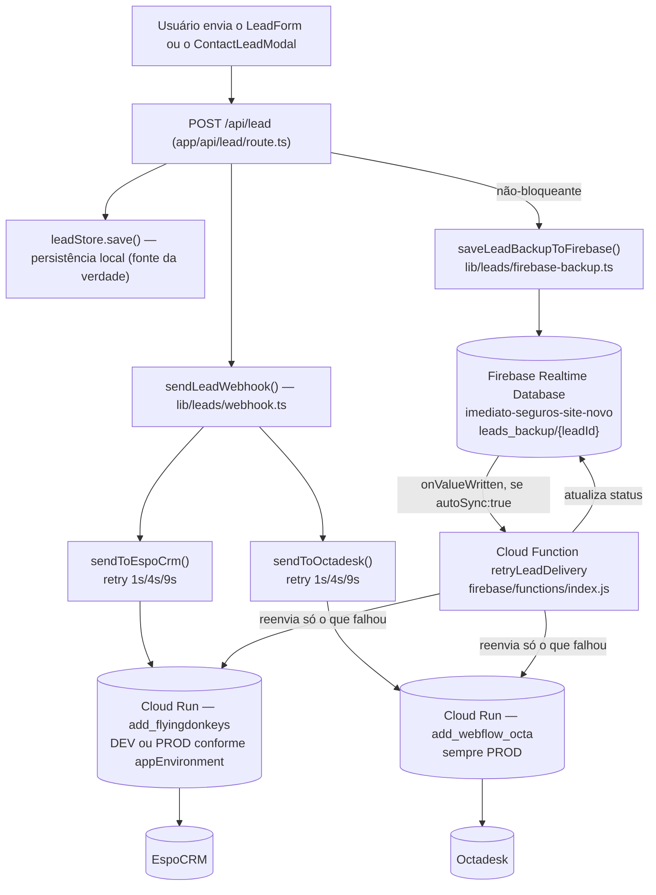

# Arquitetura — Entrega de leads (EspoCRM/Octadesk) + backup Firebase + Cloud Function

## Finalidade

Documentar a arquitetura implementada em 2026-07-12 para reproduzir, no site novo, o comportamento completo do site legado no envio de leads a EspoCRM e Octadesk — incluindo o backup no Firebase Realtime Database e uma Cloud Function própria para reentrega assíncrona — respeitando os ambientes `development`/`staging` (UAT)/`production`.

## Origem

Projeto aprovado pelo cliente em 2026-07-12, após a auditoria do mecanismo equivalente no site legado (ver `docs/ANALISE_ESPOCRM_OCTADESK_FIREBASE_CLOUDRUN.md`). Decisões do cliente que moldam este desenho:
- Replicar o comportamento **completo** do legado (entrega direta + backup Firebase + Cloud Function de reentrega), não só a entrega direta que já existia.
- UAT = ambiente `staging` do site novo; usa a mesma URL "dev" do EspoCRM que o `development` local usa. Octadesk sempre produção nos 3 ambientes (sem endpoint de teste).
- Projeto Firebase **novo e dedicado** ao site novo (`imediato-seguros-site-novo`), não o `leads-imediato-seguros` do legado — evita misturar dados dos dois sites.

## Diagrama do fluxo completo

## Camada 1 — Entrega direta (já existia, sem mudanças de comportamento)

`lib/leads/webhook.ts` chama `sendToEspoCrm()` e `sendToOctadesk()` em paralelo, cada um com retry exponencial (1s/4s/9s, `lib/leads/proxy-sender.ts`). Esta é a via principal — rápida, síncrona com a resposta ao usuário.

### Mapeamento de ambientes (novo, 2026-07-12)

A URL do EspoCRM passou a ser resolvida automaticamente por `appEnvironment` (`lib/env.ts`), em vez de uma única variável fixa:

| Ambiente (`appEnvironment`) | URL EspoCRM usada | URL Octadesk usada |
|---|---|---|
| `development` (local) | `LEAD_ESPOCRM_WEBHOOK_URL_DEV` (`dev.flyingdonkeys.com.br`) | `LEAD_OCTADESK_WEBHOOK_URL` (produção — único endpoint que existe) |
| `staging` (UAT — hoje o domínio de teste `comparaseguroonline.com.br`, via override `NEXT_PUBLIC_APP_ENV=staging`) | `LEAD_ESPOCRM_WEBHOOK_URL_DEV` (mesma URL do development) | `LEAD_OCTADESK_WEBHOOK_URL` |
| `production` (go-live real) | `LEAD_ESPOCRM_WEBHOOK_URL_PROD` | `LEAD_OCTADESK_WEBHOOK_URL` |

**Importante**: essa troca é automática pelo valor de `appEnvironment`, não por variável de ambiente do Vercel por "tier" (Production/Preview/Development do Vercel não correspondem 1:1 aos 3 ambientes do app — ver comentário em `lib/env.ts`, `resolveAppEnvironment()`). No dia do go-live real, basta trocar `NEXT_PUBLIC_APP_ENV` de `staging` para `production` (ou removê-lo, deixando o `VERCEL_ENV=production` da Vercel assumir) — o código passa a usar `LEAD_ESPOCRM_WEBHOOK_URL_PROD` sem precisar reconfigurar nenhuma URL.

## Camada 2 — Backup no Firebase Realtime Database

Depois que a Camada 1 tenta a entrega (com sucesso ou falha), `app/api/lead/route.ts` chama `saveLeadBackupToFirebase()` (`lib/leads/firebase-backup.ts`) de forma **não-bloqueante** — nunca atrasa nem falha a resposta ao usuário.

- Projeto Firebase dedicado: `imediato-seguros-site-novo` (criado em 2026-07-12).
- Realtime Database: `https://imediato-seguros-site-novo-default-rtdb.firebaseio.com`.
- Caminho: `leads_backup/{leadId}`, mesma estrutura de campos do `firebase_backup_leads.js` legado (`*_sent`, `*_attempts`, `*_last_error`, `autoSync`), mais `environment` (para a Cloud Function saber qual URL de EspoCRM usar ao reenviar).
- Acesso: Firebase **Admin SDK** (não o SDK client-side via CDN que o legado usa) — service account `leadbackup-admin@imediato-seguros-site-novo.iam.gserviceaccount.com`, papel `roles/firebasedatabase.admin` (só Realtime Database, sem outros escopos). Credenciais em `FIREBASE_PROJECT_ID`/`FIREBASE_CLIENT_EMAIL`/`FIREBASE_PRIVATE_KEY`/`FIREBASE_DATABASE_URL` (`.env.local` e Vercel, nunca commitadas).
- Regras do Realtime Database (`firebase/database.rules.json`): `.read`/`.write`: `false` para todo mundo — só Admin SDK e a Cloud Function (que rodam com identidade de servidor, sempre ignoram as regras) conseguem acessar.
- `autoSync: true` é gravado sempre que **EspoCRM ou Octadesk** não foram entregues na Camada 1 — é o gatilho para a Camada 3.
- Modo mock: se as 4 variáveis não estiverem configuradas, `saveLeadBackupToFirebase()` só loga um aviso e não grava nada — nunca lança erro.

## Camada 3 — Cloud Function de reentrega assíncrona

`firebase/functions/index.js` (`retryLeadDelivery`) — Cloud Function v2 (Node 22), gatilho `onValueWritten` em `leads_backup/{leadId}`.

- **Diretório fora do build do Next.js/Vercel**: `firebase/` é um projeto Node.js separado, com deploy manual via Firebase CLI (`firebase deploy`) — não faz parte de `git push`/deploy automático da Vercel. Ver `firebase/README.md` para o runbook completo.
- Se `autoSync !== true`, a função não faz nada (a maioria das execuções — o normal é a entrega direta funcionar de primeira).
- Se `autoSync === true`, reenvia só o(s) destino(s) que ainda estiverem `*_sent: false`, com o mesmo retry exponencial (1s/4s/9s) da Camada 1. Escolhe a URL de EspoCRM pelo campo `environment` do registro (produção → `ESPOCRM_PROD_URL`; dev/staging → `ESPOCRM_DEV_URL`, ambos configurados como *secrets* do Firebase, não variáveis do Vercel).
- Ao final, atualiza o registro (`*_sent`/`*_attempts`/`*_last_error`/`autoSync`). Se ainda falhar, o próprio `update()` dispara uma nova execução da função — limitado a `MAX_CF_ATTEMPTS_TOTAL = 5` rodadas por lead, depois do que marca `status: "failed_permanently"` e para (requer investigação manual no Realtime Database Console).

### Diferença deliberada em relação ao legado

A auditoria (`docs/ANALISE_ESPOCRM_OCTADESK_FIREBASE_CLOUDRUN.md`) encontrou uma contradição no site legado: o modo "Firebase-Only" ativo em produção deveria depender de uma Cloud Function para entregar o lead, mas o código do próprio `firebase_backup_leads.js` documenta que essa Cloud Function **nunca foi implementada** ("Fase 1: apenas registro"). Aqui, a Cloud Function foi implementada de fato e **testada em produção** (ver seção de validação abaixo) — e a Camada 1 (entrega direta) nunca depende dela; ela é só uma rede de segurança para os casos em que a Camada 1 falhar mesmo após seu próprio retry.

## Infraestrutura provisionada (2026-07-12)

| Recurso | Valor |
|---|---|
| Projeto Firebase | `imediato-seguros-site-novo` |
| Realtime Database | `imediato-seguros-site-novo-default-rtdb` |
| Faturamento | Plano Blaze, conta "Pagamento do Firebase" (mesma do legado) |
| Service account (Admin SDK) | `leadbackup-admin@imediato-seguros-site-novo.iam.gserviceaccount.com` — `roles/firebasedatabase.admin` |
| Cloud Function | `retryLeadDelivery` (Node 22, `us-central1`), URL: `https://retryleaddelivery-naz47uxetq-uc.a.run.app` |
| Secrets da função | `ESPOCRM_DEV_URL`, `ESPOCRM_PROD_URL`, `OCTADESK_URL` (Secret Manager) |

## Validação end-to-end (2026-07-12)

1. Lead de teste enviado via `POST /api/lead` local → gravado em `leads_backup/{leadId}` com `environment: "development"`, `espocrm_sent: true`, `octadesk_sent: false` (Octadesk real de produção rejeitou o payload de teste nesta tentativa), `autoSync: true`.
2. Registro manual de teste criado direto no Realtime Database com `espocrm_sent: false` (simulando falha) — a Cloud Function disparou em segundos, reenviou ao EspoCRM (URL "dev", conforme `environment`), teve sucesso, e atualizou o registro para `espocrm_sent: true`, `autoSync: false`, `status: "synced"`. Confirmado nos logs (`firebase functions:log`).
3. **Bug real encontrado só depois do deploy em produção real**: o backup nunca era gravado em produção (`leads_backup/{leadId}` inexistente após 3 leads de teste reais em `comparaseguroonline.com.br`), apesar de funcionar em teste local. Causa: `saveLeadBackupToFirebase()` e `enrichLeadWithPh3a()` eram chamadas "fire-and-forget" (sem `await`) em `app/api/lead/route.ts` — o runtime serverless da Vercel pode congelar/encerrar a função assim que a resposta HTTP é enviada, matando qualquer tarefa em segundo plano ainda pendente (não há `waitUntil` disponível no runtime Node usado aqui). Corrigido trocando por `await` nas duas chamadas.
4. **Reconfirmado em produção real após a correção**: lead de teste gravado corretamente em `leads_backup/{leadId}` com `environment: "staging"` (ambiente real da Vercel nesta fase) e `espocrm_sent: true`. Como o Octadesk de produção rejeitou o payload de teste, `autoSync: true` permaneceu, e a Cloud Function reagiu de verdade — `cf_retry_count` avançou a cada rodada, `octadesk_attempts` acumulando corretamente (4 por rodada). Interrompido manualmente (registro de teste apagado) antes de esgotar as 5 rodadas, para não gerar chamadas de teste demais ao Octadesk real.

## Achado paralelo (não corrigido nesta rodada)

Em todos os testes desta sessão (local e produção), o Octadesk de produção rejeitou consistentemente o payload de teste (nome/telefone claramente fictícios), mesmo depois de múltiplas rodadas de reentrega da Cloud Function. Pode ser uma rejeição legítima do lado do Octadesk (validação de conteúdo) ou um problema real a investigar separadamente — não impede a entrega ao EspoCRM (que sempre funcionou nos testes) e não foi causado por nenhuma mudança deste projeto.

## Custos esperados

Volume de leads é baixo (captação de seguros, não tráfego de alto volume) — dentro da faixa gratuita do plano Blaze na prática. Política de limpeza de artefatos de build configurada (`firebase functions:artifacts:setpolicy`, imagens de container antigas apagadas após 1 dia) para não acumular custo de armazenamento residual.

## Limitações conhecidas / trabalho futuro (fora do escopo desta rodada)

- A Cloud Function faz um número limitado de rodadas (até 5) em rajada — não é um sistema de fila com espera de horas/dias para destinos permanentemente fora do ar. Se isso for necessário no futuro, uma função agendada (Cloud Scheduler + varredura de registros `pending`) seria o próximo passo natural.
- `lib/leads/store.ts` (persistência local do lead, camada anterior a tudo isto) ainda tem o bug conhecido de gravação em sistema de arquivos somente leitura no Vercel (diagnosticado em sessão anterior, correção "tornar resiliente + usar `/tmp`" aprovada mas **ainda não implementada** — pendente, fora do escopo deste projeto).
