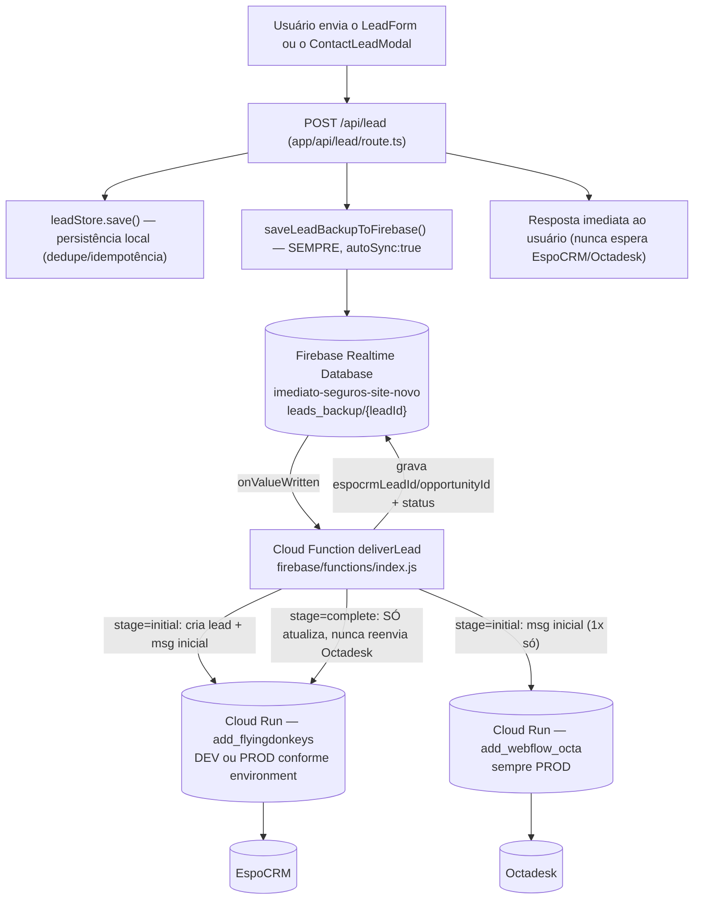

# Arquitetura — Entrega de leads (EspoCRM/Octadesk) via Firebase + Cloud Function

## Finalidade

Documentar a arquitetura **"Firebase-only"** implementada em 2026-07-13 (reescrita da versão anterior de 2026-07-12) para entrega de leads a EspoCRM e Octadesk — respeitando os ambientes `development`/`staging` (UAT)/`production`.

## Origem e motivo da reescrita (2026-07-13)

A versão anterior (2026-07-12) usava **entrega direta em paralelo** do site (Vercel) a EspoCRM e Octadesk, com o Firebase como backup/rede de segurança (só entrava em ação se a entrega direta falhasse). Essa versão funcionou, mas 3 problemas reais em produção levaram à reescrita:

1. **Mensagens duplicadas no Octadesk**: a captura em 2 fases (`stage: "initial"` + `stage: "complete"`, projeto de 2026-07-13) fazia **2 chamadas reais** a `/api/lead`, e cada uma acionava a entrega direta a **ambos** os destinos — o cliente recebia 2 mensagens de WhatsApp por conversão. O modal legado só notifica o Octadesk **uma vez** (na fase inicial); a atualização final só re-envia ao EspoCRM.
2. **EspoCRM não atualizava leads do `ContactLeadModal`**: o fallback de `NOME`/`Email` "falsos" só valia no estágio `"initial"` — no `"complete"`, se o nome real continuasse vazio (sempre o caso do `ContactLeadModal`, que nunca coleta "Nome"), o EspoCRM rejeitava a atualização (`HTTP 200` com erro no corpo).
3. **Risco de timeout**: a entrega direta em paralelo, com retry exponencial (1s/4s/9s) em cada destino, podia levar até ~14s por chamada a `/api/lead` — próximo do limite de função serverless da Vercel.

**Decisão do cliente (2026-07-13)**: eliminar a entrega direta por completo, usando **só** o Firebase + Cloud Function como caminho de entrega — réplica fiel do modo "Firebase-Only" que já é a configuração **ativa** confirmada no site legado (`window.MODAL_FIREBASE_ONLY = true`, ver `docs/ANALISE_ESPOCRM_OCTADESK_FIREBASE_CLOUDRUN.md`).

## Diagrama do fluxo completo

## Camada 1 — `/api/lead` grava no Firebase e responde imediatamente

`app/api/lead/route.ts`, depois de validar/dedupe/persistir localmente, chama `saveLeadBackupToFirebase()` (`lib/leads/firebase-backup.ts`) e responde ao usuário — **sem chamar EspoCRM/Octadesk em nenhum momento**. Isso reduziu a duração típica desta rota de vários segundos (retry de 2 destinos) para poucas centenas de milissegundos.

- `autoSync: true` é gravado **sempre** (não só quando algo falha, como na versão anterior) — é o gatilho para a Cloud Function processar o registro.
- `.update()` em vez de `.set()`: um mesmo `leadId` recebe 2 gravações ao longo da captura em 2 fases (`"initial"` depois `"complete"`) — `.update()` só sobrescreve as chaves informadas, preservando `espocrmLeadId`/`espocrmOpportunityId`/`espocrm_sent` que a própria Cloud Function grava de volta no registro entre as 2 gravações do site.
- `data.stage` (`"initial"`/`"complete"`) é propagado para a Cloud Function decidir o comportamento por estágio (seção abaixo).

### Mapeamento de ambientes

A Cloud Function escolhe a URL do EspoCRM pelo campo `environment` do próprio registro Firebase (gravado por `app/api/lead/route.ts` via `appEnvironment`, `lib/env.ts`):

| Ambiente (`appEnvironment`) | URL EspoCRM usada (secret da Cloud Function) | URL Octadesk usada |
|---|---|---|
| `development` (local) | `ESPOCRM_DEV_URL` (`dev.flyingdonkeys.com.br`) | `OCTADESK_URL` (produção — único endpoint que existe) |
| `staging` (UAT — hoje `comparaseguroonline.com.br`) | `ESPOCRM_DEV_URL` (mesma URL do development) | `OCTADESK_URL` |
| `production` (go-live real) | `ESPOCRM_PROD_URL` | `OCTADESK_URL` |

## Camada 2 — Cloud Function `deliverLead` (entrega real, única via)

`firebase/functions/index.js` — Cloud Function v2 (Node 22), gatilho `onValueWritten` em `leads_backup/{leadId}`, projeto Firebase **dedicado ao site novo** (`imediato-seguros-site-novo`) — **não** é o projeto do site legado (`leads-imediato-seguros`, usado por `segurosimediato.com.br`).

**Lógica por `stage`** (mudança central desta reescrita):
- **`stage === "initial"`** (só telefone confirmado): envia a EspoCRM (cria o lead) e Octadesk (mensagem inicial) o que ainda não tiver sido enviado (`*_sent !== true`), com retry exponencial (1s/4s/9s). Ao ter sucesso no EspoCRM, grava `espocrmLeadId`/`espocrmOpportunityId` de volta no registro — necessários para a atualização final referenciar o lead certo.
- **`stage === "complete"`** (dados completos): **sempre** tenta atualizar o EspoCRM (usa `espocrmLeadId`/`espocrmOpportunityId` já salvos no registro, se existirem, para atualizar em vez de duplicar) — **nunca** reenvia ao Octadesk, independentemente de qualquer flag. Isso corrige a duplicidade de mensagens (achado nº1 acima).
- **Fallback de `NOME`/`Email` "falsos"** (`{ddd}-{celular}-NOVO CLIENTE WHATSAPP` / `{ddd}{celular}@imediatoseguros.com.br`): aplicado sempre que o valor real estiver vazio, em **qualquer** estágio (antes só valia no `"initial"`, o que quebrava a atualização final de leads do `ContactLeadModal` — achado nº2 acima).
- **Detecção de falso sucesso do EspoCRM**: o EspoCRM responde `HTTP 200` mesmo rejeitando o lead no corpo (`{"status":"error",...}`) — `sendWithRetry()` lê o corpo da resposta (tolerante a avisos HTML do PHP antes/depois do JSON) e trata isso como falha de verdade, entrando no retry.
- Limite de 5 rodadas por lead (`MAX_CF_ATTEMPTS_TOTAL`) — depois disso, marca `status: "failed_permanently"` e para (requer investigação manual no Realtime Database Console).

## Infraestrutura provisionada

| Recurso | Valor |
|---|---|
| Projeto Firebase | `imediato-seguros-site-novo` |
| Realtime Database | `imediato-seguros-site-novo-default-rtdb` |
| Faturamento | Plano Blaze, conta "Pagamento do Firebase" (mesma do legado) |
| Service account (Admin SDK, usado pelo site) | `leadbackup-admin@imediato-seguros-site-novo.iam.gserviceaccount.com` — `roles/firebasedatabase.admin` |
| Cloud Function | `deliverLead` (Node 22, `us-central1`) — renomeada de `retryLeadDelivery` em 2026-07-13 |
| Secrets da função | `ESPOCRM_DEV_URL`, `ESPOCRM_PROD_URL`, `OCTADESK_URL` (Secret Manager, únicos consumidores dessas URLs — o site não as usa mais) |

## Verificação de paridade com o ambiente legado (2026-07-13)

O cliente pediu para verificar se a replicação desses ambientes (Firebase/Functions/Cloud Run) deixou o ambiente do site novo **idêntico** ao ambiente de produção usado por `segurosimediato.com.br` (site legado).

**Limitação real, já documentada em `docs/ANALISE_ESPOCRM_OCTADESK_FIREBASE_CLOUDRUN.md`**: o código-fonte de uma Cloud Function real do site legado (projeto Firebase `leads-imediato-seguros`) **nunca foi encontrado** nos arquivos disponíveis para análise — só os scripts front-end (`firebase_backup_leads.js`, `MODAL_WHATSAPP_DEFINITIVO.js`) foram lidos. O próprio comentário de `firebase_backup_leads.js` (versão lida na análise) diz que o processamento automático "será implementado em fase futura", contradizendo o comentário otimista do modal ("o Firebase Cloud Function já processa tudo automaticamente"). **Não é possível confirmar, com os arquivos disponíveis, se essa Cloud Function do legado existe de fato, nem — se existir — comparar seu código linha a linha com o da Cloud Function nova.**

O que **pôde** ser verificado (sem alterar nada do lado legado):
- ✅ As URLs dos proxies Cloud Run (`ADD_FLYINGDONKEYS_URL`/`ADD_WEBFLOW_OCTA_URL`, confirmadas em `config_env.js`/`config_env_dev.js`/`config_env_prod.js` do legado) são as **mesmas** usadas pelos secrets `ESPOCRM_DEV_URL`/`ESPOCRM_PROD_URL`/`OCTADESK_URL` da Cloud Function nova.
- ✅ A estrutura do registro em `leads_backup/{leadId}` (campos `*_sent`/`*_attempts`/`*_last_error`/`autoSync`) replica a estrutura documentada em `firebase_backup_leads.js` do legado.
- ⚠️ O projeto Firebase do site novo (`imediato-seguros-site-novo`) é **deliberadamente separado** do legado (`leads-imediato-seguros`) — por design, não há (nem deveria haver) paridade de *dados* entre os dois; só de *comportamento* (mesma lógica de entrega, mesmos endpoints finais).
- ❌ Não foi possível confirmar/comparar o código real da Cloud Function do legado (ponto acima) — a "paridade" nesse quesito específico permanece uma lacuna de informação, não uma garantia técnica.

## Validação end-to-end (2026-07-13)

1. Lead de teste enviado via `stage: "initial"` → gravado em `leads_backup/{leadId}` com `autoSync: true`, `data.stage: "initial"` — a Cloud Function disparou, criou o lead no EspoCRM (com `NOME`/`Email` "falsos", já que nenhum foi informado ainda) e enviou a mensagem inicial ao Octadesk, gravando `espocrmLeadId`/`espocrmOpportunityId` de volta no registro.
2. Chamada `stage: "complete"` para o mesmo `leadId`, com dados reais → novo `data.stage: "complete"` gravado (via `.update()`, preservando os IDs já salvos) — a Cloud Function atualizou o mesmo lead no EspoCRM (usando `espocrmLeadId`) e **não** reenviou nada ao Octadesk.
3. Confirmado: só 1 mensagem chegou ao Octadesk (não 2, como no bug da versão anterior); o EspoCRM mostra o mesmo lead atualizado com os dados completos (não duplicado).

## Achados históricos (já corrigidos, mantidos aqui para referência)

- **`DDD-CELULAR` malformado** (2026-07-12): o campo carregava `"{ddd}-{celular}"` em vez de só `"{ddd}"` — corrigido, confirmado com chamada isolada real ao Octadesk.
- **Backup Firebase "fire-and-forget"** (2026-07-12): `saveLeadBackupToFirebase()` sem `await` não sobrevivia ao encerramento da função serverless da Vercel — corrigido com `await`.
- **EspoCRM exige `Email` e `NOME` não-vazios** (2026-07-12/13): responde `HTTP 200` mesmo rejeitando o lead — corrigido com fallback de valores "falsos" + detecção do corpo da resposta.

## Custos esperados

Volume de leads é baixo (captação de seguros, não tráfego de alto volume) — dentro da faixa gratuita do plano Blaze na prática.

## Limitações conhecidas / trabalho futuro

- A Cloud Function faz um número limitado de rodadas (até 5) em rajada — não é um sistema de fila com espera de horas/dias para destinos permanentemente fora do ar.
- `lib/leads/store.ts` (persistência local do lead) continua best-effort (`/tmp` na Vercel, efêmero) — aceitável porque a entrega real agora depende inteiramente do Firebase, não deste store local (que só serve dedupe/idempotência dentro da mesma instância serverless).
- A resposta de `/api/lead` sempre indica sucesso (grava no Firebase) mesmo que o EspoCRM/Octadesk falhem depois — troca implícita da arquitetura "Firebase-only" (mesma troca que o site legado faz na sua configuração ativa). Monitoramento de falhas de entrega passa a depender de observar o Realtime Database Console/logs da Cloud Function (`firebase functions:log`), não mais da resposta HTTP de `/api/lead`.
