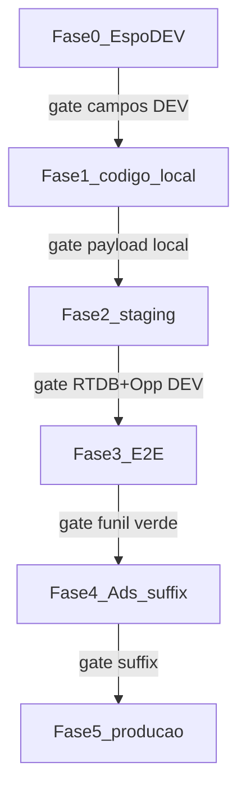

# Atribuição Google Ads → site novo → EspoCRM → venda

**Status:** plano reorganizado em fases 0–5 (2026-08-27); implementação **pendente** — próximo passo: **Fase 0** (Espo DEV).  
**Escopo:** somente site novo (`novo.segurosimediato.com.br` + Firebase `imediato-seguros-site-novo` + CF `deliverLead`) e EspoCRM.  
**Fora de escopo:** site legado/Webflow, Octadesk (sem enriquecimento adicional de params Ads), segundo projeto Firebase.

Contrato canônico do pacote de parâmetros a carregar até a **Opportunity** vendida (`cDataVenda`). Complementa [`CANAL_CAPTURA_ESPO.md`](CANAL_CAPTURA_ESPO.md), [`MEDICAO_VENDA_POR_TIPO_LEAD.md`](MEDICAO_VENDA_POR_TIPO_LEAD.md) e [`FLUXO_LEADFORM_CRM_WHATSAPP.md`](FLUXO_LEADFORM_CRM_WHATSAPP.md).

---

## 1. Por que carregar até a Opportunity

A venda real é definida na **Opportunity** (`cDataVenda`), não no Lead. Click IDs e UTMs só no Lead (ou só no RTDB) impedem placar de ROAS/campanha por venda e join Ads ↔ CRM.

Fluxo alvo:

```text
Google Ads (Exp) — auto-tagging + Final URL suffix
    → site novo (captura URL + persistência 1st-party)
    → POST /api/lead → RTDB leads_backup (utm + canal)
    → CF deliverLead
         → Espo Lead + Opportunity (pacote completo)
         → Octadesk: inalterado (só o que já envia hoje)
    → venda (cDataVenda na Opp)
```

---

## 2. Plano de execução por fases (0–5)

Produção (Espo prod, domínio prod, suffix Ads em tráfego) só entra na **Fase 5**, após gates verdes em DEV/staging. Runbook operacional: [`AMBIENTE_TESTES_SITE_NOVO.md`](AMBIENTE_TESTES_SITE_NOVO.md).



### Isolamento (infra existente)

| Sinal | Efeito |
|---|---|
| `NEXT_PUBLIC_APP_ENV=staging` | RTDB `environment: "staging"` ([`lib/leads/firebase-backup.ts`](../lib/leads/firebase-backup.ts)) |
| CF `deliverLead` | `environment !== "production"` → Espo **DEV** ([`firebase/functions/index.js`](../firebase/functions/index.js)) |
| RTDB compartilhado | Medições excluem `environment != production` |

Limites: Octadesk sempre prod (telefones de teste); suffix Ads aponta para domínio prod — atribuição **antes** do suffix usa query sintética no staging.

### Fase 0 — Espo DEV: schema (sem código)

| Item | Detalhe |
|---|---|
| Onde | `dev.flyingdonkeys.com.br` (UI Admin — Metadata API retorna 405) |
| Ações | Enum `cCanalCaptura` + pacote Ads/UTM em **Lead e Opportunity** (§3); layout “Cotação do Site”; clear cache |
| Gate | Campos visíveis no Entity Manager DEV; GET via API confirma atributos |
| Proibido | Criar campos em `flyingdonkeys.com.br` |

Ver [`CANAL_CAPTURA_ESPO.md`](CANAL_CAPTURA_ESPO.md).

### Fase 1 — Código: captura + persistência (local / branch)

| Item | Detalhe |
|---|---|
| Objetivo | Pacote de atribuição no site, validável sem Espo |
| Arquivos | Novo [`lib/leads/attribution.ts`](../lib/leads/attribution.ts); [`lib/validators.ts`](../lib/validators.ts); [`components/lead/LeadForm.tsx`](../components/lead/LeadForm.tsx); [`components/cta/ContactLeadModal.tsx`](../components/cta/ContactLeadModal.tsx); [`lib/whatsapp.ts`](../lib/whatsapp.ts) |
| Regras | §5 (persistência 1st-party) |
| Gate | Query sintética → navegar sem query → payload `/api/lead` com pacote completo (`campaign_name` incluído) |
| Proibido | Deploy prod; alterar Ads; Espo prod |

### Fase 2 — Staging: RTDB + Espo DEV

| Item | Detalhe |
|---|---|
| Objetivo | Site staging → RTDB → CF → Lead **e** Opportunity no Espo DEV |
| Provisionamento | Preview Vercel `NEXT_PUBLIC_APP_ENV=staging` — [`AMBIENTE_TESTES_SITE_NOVO.md`](AMBIENTE_TESTES_SITE_NOVO.md) §2 |
| CF | [`firebase/functions/espocrm.js`](../firebase/functions/espocrm.js): espelhar pacote completo em `buildOpportunityFields` (hoje só `cGclid`); PUT best-effort para campos novos |
| Smokes | Canal (4.2) + atribuição/persistência (4.3) |
| Gate | RTDB + Lead + Opp DEV com pacote mapeado; funil resiliente se PUT best-effort falhar |
| Proibido | Smokes CRM com `APP_ENV=production`; purga apontando para Espo prod |

### Fase 3 — Regressão funil (E2E Espo DEV)

| Item | Detalhe |
|---|---|
| Spec | [`e2e/testes-espocrm.spec.ts`](../e2e/testes-espocrm.spec.ts) |
| Env | `SITE_BASE_URL=<staging>`, `ESPO_BASE_URL=https://dev.flyingdonkeys.com.br` |
| Gate | Suite E2E verde (`CASE_FILTER=1` piloto → suite completa); cleanup só no DEV |

### Fase 4 — Google Ads: Final URL suffix

| Item | Detalhe |
|---|---|
| Pré-requisito | Fases 0–3 verdes |
| Escopo | Campanha Exp `24095000558` apenas — suffix §6; Controle `21287198336` intocado |
| Validação | Preview Ads com UTMs/ValueTrack resolvidos; URL copiada do preview → staging → smoke 4.3 |
| Gate | Suffix ativo no preview; atribuição fecha no Espo DEV via URL do Ads |

Leads prod pós-suffix só validados na Fase 5.

### Fase 5 — Produção (gate final)

| Item | Detalhe |
|---|---|
| Pré-requisito | Fases 0–4 verdes |
| Sequência | Espelhar Espo DEV → prod → deploy Vercel prod → smoke mínimo prod → monitorar 48h |
| Gate | Critérios §9; reexecutar placar comercial ([`EXPERIMENTO_PLACAR_COMERCIAL_ESPO.md`](EXPERIMENTO_PLACAR_COMERCIAL_ESPO.md)) |

---

## 3. Pacote de parâmetros (decisão fixa)

### 3.1 Click IDs (obrigatórios)

| Parâmetro URL | Campo Espo (Lead e Opp) | Utilidade |
|---|---|---|
| `gclid` | `cGclid` | Atribuição clássica Google Ads ↔ conversão/venda |
| `gbraid` | `cGbraid` | Click ID em cenários com restrição de cookie |
| `wbraid` | `cWbraid` | Click ID web/app privacy-preserving |

**Não** colocar `gclid` no Final URL suffix — a marcação automática (auto-tagging) injeta.

### 3.2 UTMs (fortemente recomendados)

| Parâmetro URL | Campo Espo (Lead e Opp) | Utilidade |
|---|---|---|
| `utm_source` | `cUtmSource` | Fonte (`google`) |
| `utm_medium` | `cUtmMedium` | Meio (`cpc`) |
| `utm_campaign` | `cUtmCampaign` | **ID** da campanha (`{campaignid}`) — join Ads |
| `campaign_name` | `cUtmCampaignName` | **Nome literal** (`{campaignname}`) — identificação humana na ficha Espo / filtros. Não misturar com `cUtmCampaign` |
| `utm_content` | `cUtmContent` | Criativo / anúncio |
| `utm_term` | `cUtmTerm` | Keyword literal (Search, `{keyword}`) |
| `utm_id` | `cUtmId` | ID estável de campanha |

### 3.3 Ads / ValueTrack extras

| Parâmetro URL | Campo Espo (Lead e Opp) | Utilidade |
|---|---|---|
| `gad_source` | `cGadSource` | Origem Ads na URL |
| `gad_campaignid` | `cGadCampaignId` | ID numérico da campanha |
| `matchtype` | `cMatchType` | Correspondência Search (`e`/`p`/`b`) |
| `device` | `cDevice` | `m` / `t` / `c` |
| `network` | `cNetwork` | Rede Google |
| `placement` | `cPlacement` | Placement Display/YouTube |
| `adgroupid` | `cAdgroupId` | ID do grupo de anúncios |
| `creative` | `cCreative` | ID do anúncio |

`cAdPosition` só se já existir no Entity Manager **e** o ValueTrack `{adposition}` for incluído no sufixo — não inventar sem uso.

### 3.4 Funil site novo (não vêm do Ads)

| Origem site | Campo Espo | Utilidade |
|---|---|---|
| `captureChannel` + `modalChannel` | `cCanalCaptura` | `formulario` / `whatsapp` / `telefone` |
| constante CF | `cWebpage` | `novo.segurosimediato.com.br` |

Ver [`CANAL_CAPTURA_ESPO.md`](CANAL_CAPTURA_ESPO.md).

### 3.5 Metadados de landing (payload site / RTDB; Espo opcional)

| Campo payload `utm` | Nota |
|---|---|
| `landing_page` | path da primeira captura útil |
| `referrer` | `document.referrer` na captura |

Não são obrigatórios no Entity Manager nesta fase; permanecem no RTDB para auditoria.

---

## 4. Mapeamento ponta a ponta

| Camada | Onde | Estado em 2026-08-21 (antes da implementação) |
|---|---|---|
| URL Ads | Final URL + auto-tagging | `gclid` via auto-tagging; ValueTrack/UTMs no sufixo da campanha Exp **a configurar** |
| Captura site | `captureUtmFromLocation` em [`lib/validators.ts`](../lib/validators.ts) | Lê gclid/gbraid/wbraid + 5 UTMs; **sem** `campaign_name` / `gad_*` / ValueTrack; **sem** persistência |
| Persistência | (a criar) ex. `lib/leads/attribution.ts` | **Pendente** — TTL ~90 dias (alinhado a `_gcl_aw`); incluir `campaign_name` no pacote `utm` |
| API / RTDB | `/api/lead`, `data.utm` | Espelha o objeto `utm` do payload |
| CF Lead | `buildLeadFields` em [`firebase/functions/espocrm.js`](../firebase/functions/espocrm.js) | UTMs + `cGbraid`; falta `cWbraid`, `cUtmCampaignName`, pacote gad_/ValueTrack |
| CF Opportunity | `buildOpportunityFields` | **Só `cGclid` hoje** — gap crítico para venda (incluir `cUtmCampaignName` + pacote completo) |
| CF canal | `canalCapturaFields` + PUT separado | Código deployado; Enum Espo pendente |
| Octadesk | `octadesk.js` / proxy | **Não enriquecer** neste plano (já envia `GCLID_FLD` / utm mínimos no proxy) |
| Legado | Webflow | **Intocado** |

Campos novos/ausentes no Entity Manager devem ir em **PUT best-effort separado** (mesmo padrão de `cCanalCaptura`), nunca no POST de criação Lead/Opp, para não quebrar o funil se o atributo ainda não existir.

---

## 5. Persistência 1st-party (regra)

1. No primeiro hit com query Ads/UTM, gravar o pacote em storage 1st-party (preferência: `localStorage` com timestamp; cookie só se necessário para paridade).
2. Em submits posteriores (form multi-step, modal WA/telefone), **mesclar** query atual ∪ storage (valores novos na URL sobrescrevem; não apagar click ID existente sem substituto).
3. TTL sugerido: **90 dias** desde a última gravação com click ID.
4. `landing_page` / `referrer`: preferir o da **primeira** captura da sessão de atribuição.

Sem persistência, o usuário clica no anúncio, navega e abre o modal sem query → perde `gclid` e a venda não fecha o loop Ads.

---

## 6. Google Ads — campanha Exp apenas

| Item | Valor |
|---|---|
| Campanha | Exp site novo `24095000558` |
| Domínio final | `novo.segurosimediato.com.br` |
| Controle legado | `21287198336` — **não** alterar sufixo/template |
| Auto-tagging | Conta com marcação automática **ligada** |

### Final URL suffix (colar na campanha Exp)

```text
utm_source=google&utm_medium=cpc&utm_campaign={campaignid}&utm_id={campaignid}&utm_content={creative}&utm_term={keyword}&gad_source=1&gad_campaignid={campaignid}&matchtype={matchtype}&device={device}&network={network}&placement={placement}&adgroupid={adgroupid}&creative={creative}&campaign_name={campaignname}
```

Checklist operacional:

1. Confirmar auto-tagging na conta.
2. Aplicar o sufixo **somente** na campanha `24095000558` (nível campanha; não na conta inteira).
3. Preview de anúncio / URL final: conferir UTMs + ValueTrack resolvidos (`campaign_name` = nome literal; `utm_campaign` = ID); `gclid` presente após clique real.
4. Não aplicar o mesmo sufixo na campanha Controle.

Scripts de ops Ads existentes em [`scripts/google-ops/`](../scripts/google-ops/) (auditoria/URLs Exp); script de mutate do sufixo pode ser adicionado na execução — até lá, UI do Google Ads basta.

---

## 7. EspoCRM — ordem DEV → prod

Resumo alinhado às **Fases 0 e 5** (§2):

1. **Fase 0 — `dev.flyingdonkeys.com.br`:** Enum `cCanalCaptura` + pacote Ads/UTM em Lead e Opportunity; layout “Cotação do Site”; clear cache.
2. **Fases 1–4:** validar com staging (`environment=staging` → CF → Espo DEV). Ver [`AMBIENTE_TESTES_SITE_NOVO.md`](AMBIENTE_TESTES_SITE_NOVO.md).
3. **Fase 5 — `flyingdonkeys.com.br`:** espelhar Entity Manager de DEV → prod.

Na CF futura: mapear `utm.campaign_name` → `cUtmCampaignName` em `buildLeadFields` e `buildOpportunityFields`; se o campo ainda não existir no Entity Manager, PUT best-effort separado (mesmo padrão de `cCanalCaptura`).

Metadata API com a chave atual costuma retornar **405** na criação de campos — preferir UI Admin / Entity Manager.

---

## 8. Exclusões explícitas

- Site legado / Webflow / proxy `mdmidia` — sem mudanças.
- Octadesk — sem novos params Ads neste plano.
- Conta Google Ads inteira / campanha Controle — sem Final URL suffix deste pacote.
- Incluir params Ads incompletos no POST de criação Espo se o campo ainda não existir — proibido; usar PUT best-effort.

---

## 9. Critérios de aceite (Fase 5)

1. Landing com query sintética completa (incluir `campaign_name=...`) → após navegar sem query → submit form/modal → RTDB `data.utm` com click IDs + UTMs + `campaign_name` preservados.
2. Espo DEV: Lead **e** Opp com o pacote mapeado (`cUtmCampaign` = ID, `cUtmCampaignName` = nome literal); `cCanalCaptura` correto por canal.
3. Campanha Exp: sufixo ativo (com `{campaignname}`); Controle intacto.
4. Funil principal (criação Lead/Opp, etapas, Octadesk) **não** quebra se algum campo Espo ainda faltar.

---

## 10. Referências

- Plano operacional por fases: §2 deste documento; runbook [`AMBIENTE_TESTES_SITE_NOVO.md`](AMBIENTE_TESTES_SITE_NOVO.md)
- [`AMBIENTE_TESTES_SITE_NOVO.md`](AMBIENTE_TESTES_SITE_NOVO.md)
- [`CANAL_CAPTURA_ESPO.md`](CANAL_CAPTURA_ESPO.md)
- [`FASE_A_GTM_ESPOCRM_OPS.md`](FASE_A_GTM_ESPOCRM_OPS.md)
- [`ARQUITETURA_LEADS_FIREBASE_CLOUD_FUNCTION.md`](ARQUITETURA_LEADS_FIREBASE_CLOUD_FUNCTION.md)
