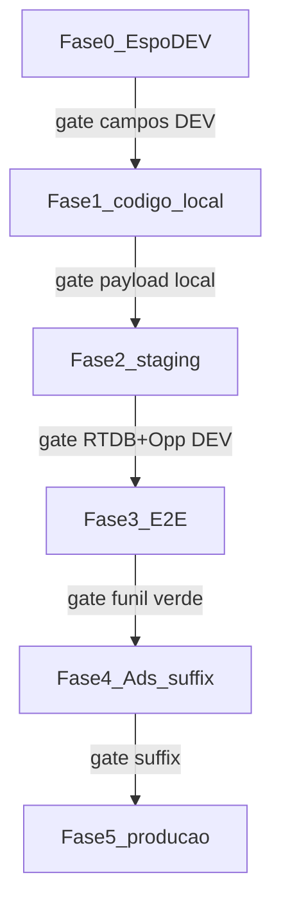

# Atribuição Google Ads → site novo → EspoCRM → venda

**Status:** Fases 0–4 **verdes** (2026-08-29). Fase 5 (prod) — runbook preparado; execução pendente.  
**Escopo:** somente site novo (`novo.segurosimediato.com.br` + Firebase `imediato-seguros-site-novo` + CF `deliverLead`) e EspoCRM.  
**Fora de escopo:** site legado/Webflow, Octadesk (sem enriquecimento adicional de params Ads), segundo projeto Firebase.

Contrato canônico do pacote de parâmetros a carregar até a **Opportunity** vendida (`cDataVenda`). Complementa [`CANAL_CAPTURA_ESPO.md`](CANAL_CAPTURA_ESPO.md), [`MEDICAO_VENDA_POR_TIPO_LEAD.md`](MEDICAO_VENDA_POR_TIPO_LEAD.md) e [`FLUXO_LEADFORM_CRM_WHATSAPP.md`](FLUXO_LEADFORM_CRM_WHATSAPP.md).

---

## 1. Por que carregar até a Opportunity

A venda real é definida na **Opportunity** (`cDataVenda`), não no Lead. Click IDs e UTMs só no Lead (ou só no RTDB) impedem placar de ROAS/campanha por venda e join Ads ↔ CRM.

Fluxo alvo:

```text
Google Ads (Exp) — auto-tagging + Final URL suffix
    → site novo (captura URL + persistência 1st-party)
    → POST /api/lead → RTDB leads_backup (utm + canal)
    → CF deliverLead
         → Espo Lead + Opportunity (pacote completo)
         → Octadesk: inalterado (só o que já envia hoje)
    → venda (cDataVenda na Opp)
```

---

## 2. Plano de execução por fases (0–5)

Produção (Espo prod, domínio prod, suffix Ads em tráfego) só entra na **Fase 5**, após gates verdes em DEV/staging. Runbook operacional: [`AMBIENTE_TESTES_SITE_NOVO.md`](AMBIENTE_TESTES_SITE_NOVO.md).



### Isolamento (infra existente)

| Sinal | Efeito |
|---|---|
| `NEXT_PUBLIC_APP_ENV=staging` | RTDB `environment: "staging"` ([`lib/leads/firebase-backup.ts`](../lib/leads/firebase-backup.ts)) |
| CF `deliverLead` | `environment !== "production"` → Espo **DEV** ([`firebase/functions/index.js`](../firebase/functions/index.js)) |
| RTDB compartilhado | Medições excluem `environment != production` |

Limites: Octadesk sempre prod (telefones de teste); suffix Ads aponta para domínio prod — atribuição **antes** do suffix usa query sintética no staging.

### Fase 0 — Espo DEV: schema (sem código)

| Item | Detalhe |
|---|---|
| Onde | `dev.flyingdonkeys.com.br` (UI Admin — `api_dev` recebe **403** em `Admin/fieldManager`) |
| Ações | Enum `cCanalCaptura` + pacote Ads/UTM em **Lead e Opportunity** (§3); layout “Cotação do Site”; clear cache / rebuild |
| Gate | Campos visíveis no Entity Manager DEV; inventário via `node scripts/espo-ops/fase0-attribution-fields.mjs` |
| Proibido | Criar campos em `flyingdonkeys.com.br` |

**Inventário DEV (2026-08-28, Metadata API read-only):**

| Entidade | Já existem | Faltam |
|---|---|---|
| **Lead** | `cGclid`, `cGbraid`, UTMs (exceto nome/id), gad_*, `cMatchType`, `cDevice`, `cNetwork`, `cPlacement`, `cCreative`, `cWebpage` | `cCanalCaptura`, `cWbraid`, `cUtmCampaignName`, `cUtmId`, `cAdgroupId` |
| **Opportunity** | `cGclid`, `cWebpage` | `cCanalCaptura` + pacote Ads/UTM completo (gbraid/wbraid, UTMs, gad_*, ValueTrack) |

**Checklist UI Admin (DEV)** — Field Manager prefixa `c` sozinho: digite o nome **sem** o `c` inicial (ex.: `canalCaptura` → `cCanalCaptura`):

1. Administração → Entity Manager → **Lead** → Fields → Add Field:
   - Enum `canalCaptura` — opções: `formulario` / `whatsapp` / `telefone` (rótulos: Formulário / Modal WhatsApp / Modal telefone)
   - Varchar: `wbraid`, `utmCampaignName`, `utmId`, `adgroupId`
2. Repetir em **Opportunity** com o pacote completo (Enum + todos os Varchar da tabela §3 que ainda não existirem — na Opp quase todos).
3. Layout Manager → Lead e Opportunity → Detail → painel “Cotação do Site” (arrastar os novos campos).
4. Administração → Rebuild + Clear cache.
5. Rodar: `node scripts/espo-ops/fase0-attribution-fields.mjs --prefer=dev` → gate verde.

**Alternativa:** ampliar a Role do `api_dev` com permissão de Field Manager / Admin e reexecutar `node scripts/espo-ops/fase0-attribution-fields.mjs --create --rebuild --prefer=dev`.

Ver [`CANAL_CAPTURA_ESPO.md`](CANAL_CAPTURA_ESPO.md).

### Fase 1 — Código: captura + persistência (local / branch) — ✅ 2026-08-29

| Item | Detalhe |
|---|---|
| Objetivo | Pacote de atribuição no site, validável sem Espo |
| Feito | [`lib/leads/attribution.ts`](../lib/leads/attribution.ts) (`localStorage`, TTL 90d, merge); `utmSchema`/`captureUtmFromLocation` ampliados; `LeadForm` / `ContactLeadModal` / `whatsapp` / `PageAnalytics` usam `getAttributionUtm` |
| Gate | Query sintética → navegar sem query → payload `/api/lead` com pacote completo (`campaign_name` incluído) — validar no DevTools em localhost |
| Proibido | Deploy prod; alterar Ads; Espo prod |

### Fase 2 — Staging: RTDB + Espo DEV — ✅ 2026-08-29

| Item | Detalhe |
|---|---|
| Objetivo | Site staging → RTDB → CF → Lead **e** Opportunity no Espo DEV |
| CF | Deploy `deliverLead` em `imediato-seguros-site-novo`: Lead core (gad_/ValueTrack) no POST; Lead extended + **Opp pacote completo** em PUT best-effort (`attributionOpportunityFields`) — Opp POST mantém só `cGclid` até Fase 5 (prod sem schema) |
| Smokes | Canal formulario/whatsapp/telefone OK; RTDB `environment=staging` → Lead+Opp DEV com pacote + `cUtmCampaignName` |
| Scripts | [`scripts/espo-ops/fase2-attribution-smoke.mjs`](../scripts/espo-ops/fase2-attribution-smoke.mjs), [`fase2-rtdb-attribution-smoke.mjs`](../scripts/espo-ops/fase2-rtdb-attribution-smoke.mjs) |
| Gate | RTDB + Lead + Opp DEV com pacote mapeado — **verde** |
| Staging Vercel | Preview: definir `NEXT_PUBLIC_APP_ENV=staging` + espelhar `FIREBASE_*` do Production (site Preview ainda opcional se o gate RTDB já validou a CF) |
| Proibido | Smokes CRM com `APP_ENV=production`; purga apontando para Espo prod |

### Fase 3 — Regressão funil (E2E Espo DEV) — ✅ 2026-08-29

| Item | Detalhe |
|---|---|
| Spec | [`e2e/testes-espocrm.spec.ts`](../e2e/testes-espocrm.spec.ts) |
| Env | `SITE_BASE_URL=http://localhost:3000` (`NEXT_PUBLIC_APP_ENV=staging`) + `ESPO_BASE_URL=https://dev.flyingdonkeys.com.br` |
| Gate | Piloto `CASE_FILTER=1` + suite **23/23 passed** (~41 min); Lead+Opp DEV por caso; cleanup só no DEV |
| Resultado | [`e2e/testes-espocrm.resultado-fase3.json`](../e2e/testes-espocrm.resultado-fase3.json) |
| Harness | Reset do store local entre casos (dedupe telefone em localhost); assert CRM Lead+Opp; guarda anti-prod no `ESPO_BASE_URL` |

### Fase 4 — Google Ads: Final URL suffix (substituir, sem empilhar) — ✅ 2026-08-29

| Item | Detalhe |
|---|---|
| Pré-requisito | Fases 0–3 verdes; inventário de tracking/suffix (§6.1) |
| Escopo | **Somente** campanha Exp `24095000558` — **substituir** o `finalUrlSuffix` pelo canônico §6.2 |
| Intocado | Controle `21287198336`; `trackingUrlTemplate` da Exp/conta; nível conta; ad groups/ads (sem override) |
| Proibido | Concatenar o canônico ao suffix atual; alterar Controle; desligar auto-tagging; colar `gclid` no novo suffix |
| Execução | `ads-set-exp-final-url-suffix.mjs --apply` (autorização explícita 2026-08-29) |
| Artefatos | Backup `ads-fase4-suffix-backup.json`; result `ads-fase4-suffix-result.json`; re-audit `ads-tracking-suffix-check.json` |
| Validação | Inventário: Exp=canônico, sem `gclid`/dupes no suffix; Controle=legado; smoke Ads-like → RTDB staging → Espo DEV |
| Gate | **Verde** — script [`fase4-ads-url-smoke.mjs`](../scripts/espo-ops/fase4-ads-url-smoke.mjs) |

**Por que “substituir” eliminou o conflito:** a Exp tinha `finalUrlSuffix` legado (= conta/Controle). Empilhar o canônico duplicaria UTMs/`gclid`. A Fase 4 **trocou** o suffix da Exp pelo texto §6.2; o `trackingUrlTemplate` (`{lpurl}?gclid={gclid}`) permanece.

Leads prod pós-suffix só entram no aceite formal na Fase 5.

### Fase 5 — Produção (gate final)

| Item | Detalhe |
|---|---|
| Pré-requisito | Fases 0–4 verdes |
| Runbook | [`FASE5_ROLLOUT_PRODUCAO.md`](FASE5_ROLLOUT_PRODUCAO.md) (D0 pré-voo + D1 rollout 2026-08-30) |
| Sequência | Inventário Espo prod → espelhar Entity Manager → deploy Vercel prod → smoke `fase5-prod-smoke.mjs` → monitorar 48h |
| CF | Sem mutate obrigatório: Opp POST só `cGclid`; pacote em PUT best-effort (já deployado) |
| Gate | Critérios §9; placar comercial ([`EXPERIMENTO_PLACAR_COMERCIAL_ESPO.md`](EXPERIMENTO_PLACAR_COMERCIAL_ESPO.md)) |
| Proibido | Alterar Controle Ads; suite E2E completa em prod; smoke sem `--i-know-this-is-prod` |

---

## 3. Pacote de parâmetros (decisão fixa)

### 3.1 Click IDs (obrigatórios)

| Parâmetro URL | Campo Espo (Lead e Opp) | Utilidade |
|---|---|---|
| `gclid` | `cGclid` | Atribuição clássica Google Ads ↔ conversão/venda |
| `gbraid` | `cGbraid` | Click ID em cenários com restrição de cookie |
| `wbraid` | `cWbraid` | Click ID web/app privacy-preserving |

**Não** colocar `gclid` no Final URL suffix — a marcação automática (auto-tagging) injeta.

### 3.2 UTMs (fortemente recomendados)

| Parâmetro URL | Campo Espo (Lead e Opp) | Utilidade |
|---|---|---|
| `utm_source` | `cUtmSource` | Fonte (`google`) |
| `utm_medium` | `cUtmMedium` | Meio (`cpc`) |
| `utm_campaign` | `cUtmCampaign` | **ID** da campanha (`{campaignid}`) — join Ads |
| `campaign_name` | `cUtmCampaignName` | **Nome literal** (`{campaignname}`) — identificação humana na ficha Espo / filtros. Não misturar com `cUtmCampaign` |
| `utm_content` | `cUtmContent` | Criativo / anúncio |
| `utm_term` | `cUtmTerm` | Keyword literal (Search, `{keyword}`) |
| `utm_id` | `cUtmId` | ID estável de campanha |

### 3.3 Ads / ValueTrack extras

| Parâmetro URL | Campo Espo (Lead e Opp) | Utilidade |
|---|---|---|
| `gad_source` | `cGadSource` | Origem Ads na URL |
| `gad_campaignid` | `cGadCampaignId` | ID numérico da campanha |
| `matchtype` | `cMatchType` | Correspondência Search (`e`/`p`/`b`) |
| `device` | `cDevice` | `m` / `t` / `c` |
| `network` | `cNetwork` | Rede Google |
| `placement` | `cPlacement` | Placement Display/YouTube |
| `adgroupid` | `cAdgroupId` | ID do grupo de anúncios |
| `creative` | `cCreative` | ID do anúncio |

`cAdPosition` só se já existir no Entity Manager **e** o ValueTrack `{adposition}` for incluído no sufixo — não inventar sem uso.

### 3.4 Funil site novo (não vêm do Ads)

| Origem site | Campo Espo | Utilidade |
|---|---|---|
| `captureChannel` + `modalChannel` | `cCanalCaptura` | `formulario` / `whatsapp` / `telefone` |
| constante CF | `cWebpage` | `novo.segurosimediato.com.br` |

Ver [`CANAL_CAPTURA_ESPO.md`](CANAL_CAPTURA_ESPO.md).

### 3.5 Metadados de landing (payload site / RTDB; Espo opcional)

| Campo payload `utm` | Nota |
|---|---|
| `landing_page` | path da primeira captura útil |
| `referrer` | `document.referrer` na captura |

Não são obrigatórios no Entity Manager nesta fase; permanecem no RTDB para auditoria.

---

## 4. Mapeamento ponta a ponta

| Camada | Onde | Estado (2026-08-29) |
|---|---|---|
| URL Ads | Final URL + auto-tagging | `gclid` via auto-tagging; ValueTrack/UTMs no sufixo canônico da Exp (**Fase 4 feita**) |
| Captura site | `captureUtmFromLocation` + [`lib/leads/attribution.ts`](../lib/leads/attribution.ts) | Pacote completo + persistência 90d (Fase 1) |
| API / RTDB | `/api/lead`, `data.utm` | Espelha o objeto `utm` do payload |
| CF Lead | `buildLeadFields` + `attributionLeadExtendedFields` | Core (incl. gad_/ValueTrack) no POST; extended (wbraid, campaign_name, utm_id, adgroupid) em PUT best-effort |
| CF Opportunity | `cGclid` no POST + `attributionOpportunityFields` | **Pacote completo em PUT best-effort** (Fase 2); POST sem campos novos até Espo prod (Fase 5) |
| CF canal | `canalCapturaFields` + PUT separado | Deployado; Enum DEV criado (Fase 0) |
| Octadesk | `octadesk.js` / proxy | **Não enriquecer** neste plano |
| Legado | Webflow | **Intocado** |

Campos novos/ausentes no Entity Manager devem ir em **PUT best-effort separado** (mesmo padrão de `cCanalCaptura`), nunca no POST de criação Lead/Opp, para não quebrar o funil se o atributo ainda não existir.

---

## 5. Persistência 1st-party (regra)

1. No primeiro hit com query Ads/UTM, gravar o pacote em storage 1st-party (preferência: `localStorage` com timestamp; cookie só se necessário para paridade).
2. Em submits posteriores (form multi-step, modal WA/telefone), **mesclar** query atual ∪ storage (valores novos na URL sobrescrevem; não apagar click ID existente sem substituto).
3. TTL sugerido: **90 dias** desde a última gravação com click ID.
4. `landing_page` / `referrer`: preferir o da **primeira** captura da sessão de atribuição.

Sem persistência, o usuário clica no anúncio, navega e abre o modal sem query → perde `gclid` e a venda não fecha o loop Ads.

---

## 6. Google Ads — campanha Exp apenas

| Item | Valor |
|---|---|
| Campanha | Exp site novo `24095000558` |
| Domínio final | `novo.segurosimediato.com.br` |
| Controle legado | `21287198336` — **não** alterar sufixo/template |
| Auto-tagging | Conta com marcação automática **ligada** (manter) |

### 6.1 Inventário (API) — pré e pós Fase 4

Audit: [`ads-check-tracking-suffix.mjs`](../scripts/google-ops/ads-check-tracking-suffix.mjs) → `ads-tracking-suffix-check.json`. Mutate: [`ads-set-exp-final-url-suffix.mjs`](../scripts/google-ops/ads-set-exp-final-url-suffix.mjs).

| Nível | `trackingUrlTemplate` | `finalUrlSuffix` (após Fase 4) |
|---|---|---|
| Conta `9947918772` | `{lpurl}?gclid={gclid}` | pacote legado (intocado) |
| Exp `24095000558` | `{lpurl}?gclid={gclid}` | **canônico §6.2** (substituído 2026-08-29) |
| Controle `21287198336` | `{lpurl}?gclid={gclid}` | pacote legado (intocado) |
| Ad groups / ads Exp | *(vazio — sem override)* | *(vazio)* |

**Suffix legado (backup; ainda na conta/Controle):**

```text
utm_source=google&utm_medium=cpc&utm_campaign={campaignid}&utm_content={adgroupid}&utm_term={keyword}&matchtype={matchtype}&network={network}&device={device}&creative={creative}&gclid={gclid}
```

| Campo | Legado → canônico | Nota |
|---|---|---|
| `gclid` no suffix | remove | Redundante; fica auto-tagging + template `{lpurl}?gclid={gclid}` |
| `utm_content` | `{adgroupid}` → `{creative}` | Significado muda; `adgroupid` passa a param próprio |
| Novos | `utm_id`, `campaign_name`, `gad_*`, `placement`, `adgroupid` | Necessários ao pacote Espo |

**Decisão anti-conflito (aplicada):**

1. **Substituído** `campaign.finalUrlSuffix` da Exp pelo canônico §6.2 (um único texto; nunca suffix_legado + canônico).
2. **Não alterado** `trackingUrlTemplate` da Exp nem da conta (`{lpurl}?gclid={gclid}` permanece).
3. **Não alterado** Controle nem o `finalUrlSuffix` da conta (a Exp sobrescreve no nível campanha).
4. Re-audit pós-mutate: Exp = canônico; Controle = legado; ad groups/ads ainda sem override.

### 6.2 Final URL suffix canônico (alvo na Exp)

```text
utm_source=google&utm_medium=cpc&utm_campaign={campaignid}&utm_id={campaignid}&utm_content={creative}&utm_term={keyword}&gad_source=1&gad_campaignid={campaignid}&matchtype={matchtype}&device={device}&network={network}&placement={placement}&adgroupid={adgroupid}&creative={creative}&campaign_name={campaignname}
```

### 6.3 Checklist operacional (Fase 4) — concluída 2026-08-29

1. ~~Confirmar auto-tagging; inventário §6.1~~ ✅
2. ~~Backup do suffix legado~~ ✅ `ads-fase4-suffix-backup.json`
3. ~~Substituir `finalUrlSuffix` só em `24095000558`~~ ✅ `--apply`
4. ~~Não editar template / Controle / conta~~ ✅
5. ~~Params canônicos sem duplicata / sem `gclid` no suffix~~ ✅
6. ~~URL Ads-like → staging → Espo DEV~~ ✅ `fase4-ads-url-smoke.mjs`
7. ~~Re-audit~~ ✅ Exp = canônico; Controle inalterado

Scripts: [`scripts/google-ops/`](../scripts/google-ops/), [`scripts/espo-ops/fase4-ads-url-smoke.mjs`](../scripts/espo-ops/fase4-ads-url-smoke.mjs).

---

## 7. EspoCRM — ordem DEV → prod

Resumo alinhado às **Fases 0 e 5** (§2):

1. **Fase 0 — `dev.flyingdonkeys.com.br`:** Enum `cCanalCaptura` + pacote Ads/UTM em Lead e Opportunity; layout “Cotação do Site”; clear cache.
2. **Fases 1–4:** validar com staging (`environment=staging` → CF → Espo DEV). Ver [`AMBIENTE_TESTES_SITE_NOVO.md`](AMBIENTE_TESTES_SITE_NOVO.md).
3. **Fase 5 — `flyingdonkeys.com.br`:** espelhar Entity Manager de DEV → prod.

Na CF futura: mapear `utm.campaign_name` → `cUtmCampaignName` em `buildLeadFields` e `buildOpportunityFields`; se o campo ainda não existir no Entity Manager, PUT best-effort separado (mesmo padrão de `cCanalCaptura`).

Metadata API com a chave atual costuma retornar **405** na criação de campos — preferir UI Admin / Entity Manager.

---

## 8. Exclusões explícitas

- Site legado / Webflow / proxy `mdmidia` — sem mudanças.
- Octadesk — sem novos params Ads neste plano.
- Conta Google Ads inteira / campanha Controle — sem Final URL suffix deste pacote.
- Incluir params Ads incompletos no POST de criação Espo se o campo ainda não existir — proibido; usar PUT best-effort.

---

## 9. Critérios de aceite (Fase 5 — produção)

Runbook operacional: [`FASE5_ROLLOUT_PRODUCAO.md`](FASE5_ROLLOUT_PRODUCAO.md).

1. Schema Espo **prod** (`flyingdonkeys.com.br`) = pacote DEV (inventário `fase0-attribution-fields.mjs --prefer=prod` sem MISSING).
2. Landing prod com query Ads-like (incluir `campaign_name`) → navegar sem query → submit form/modal → RTDB `environment=production` com `data.utm` completo.
3. Espo **prod**: Lead **e** Opp com pacote mapeado (`cUtmCampaign` = ID, `cUtmCampaignName` = nome literal); `cCanalCaptura` correto por canal.
4. Campanha Exp: sufixo canônico ativo; Controle intacto.
5. Funil principal (criação Lead/Opp, etapas, Octadesk) **não** quebra se algum PUT best-effort falhar.
6. Sem regressão óbvia GTM/Ads no domínio novo.

Validação DEV/staging (Fases 2–4) permanece referência; o aceite formal da atribuição em produção é este §9.

---

## 10. Referências

- [`FASE5_ROLLOUT_PRODUCAO.md`](FASE5_ROLLOUT_PRODUCAO.md)
- [`AMBIENTE_TESTES_SITE_NOVO.md`](AMBIENTE_TESTES_SITE_NOVO.md)
- [`CANAL_CAPTURA_ESPO.md`](CANAL_CAPTURA_ESPO.md)
- [`FASE_A_GTM_ESPOCRM_OPS.md`](FASE_A_GTM_ESPOCRM_OPS.md)
- [`ARQUITETURA_LEADS_FIREBASE_CLOUD_FUNCTION.md`](ARQUITETURA_LEADS_FIREBASE_CLOUD_FUNCTION.md)
