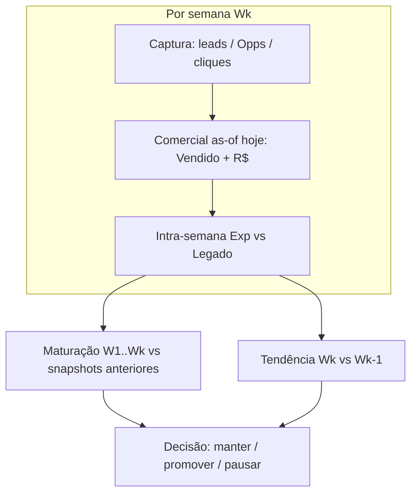

# Plano ampliado — placar comercial do experimento (EspoCRM)

**Status:** PLANEJADO (2026-08-22)  
**Complementa:** [`ANALISE_EXPERIMENTO_COMPARATIVO_2026-08-10-14_vs_2026-08-17-21.md`](ANALISE_EXPERIMENTO_COMPARATIVO_2026-08-10-14_vs_2026-08-17-21.md), [`MEDICAO_VENDA_POR_TIPO_LEAD.md`](MEDICAO_VENDA_POR_TIPO_LEAD.md), [`ATRIBUICAO_ADS_SITE_NOVO_ESPO.md`](ATRIBUICAO_ADS_SITE_NOVO_ESPO.md)  
**Operação:** somente leitura (Espo + Firebase + Ads). Nenhuma alteração em campanha, site ou CRM durante a coleta.

---

## 1. Premissas de negócio (Imediato)

| Premissa | Implicação analítica |
|---|---|
| Negociação **lenta** | Venda pode ocorrer **dias ou semanas** após a captura do lead. Comparar só leads na janela da semana **subestima** o site que gera leads “bons porém tardios”. |
| **Volume de leads ≠ eficiência** | Lead rate (gclid/clique) é indicador **operacional**, não decisório. O placar comercial prioriza **conversão em venda** e **valor**. |
| Venda = estágio **`Vendido`** na Opportunity | Definição operacional pedida pelo time. Deve ser cruzada com `cDataVenda` e `amount` até estabilizar o contrato de dados. |
| Valor = **`amount`** (“Valor Comissão”) | Comparar **Σ comissão (R$)**, comissão média por venda e comissão por clique/lead — captura elasticidade de bolso / mix de produto. |
| Relatório **sempre “as-of” hoje** | Ao emitir o relatório da **Wn**, reexecutar Espo **na data de emissão** para W1…Wn: leads congelados na janela; vendas e R$ **acumulam** conforme amadurecem. |

---

## 2. Considerações técnicas e de dados

### 2.1 `stage = Vendido` vs `cDataVenda`

Descoberta anterior ([`MEDICAO_VENDA_POR_TIPO_LEAD.md`](MEDICAO_VENDA_POR_TIPO_LEAD.md) §2): há Opps em `Vendido` **sem** `cDataVenda` preenchida e vice-versa.

**Recomendação do plano ampliado:**

| Papel | Campo | Uso |
|---|---|---|
| **Placar principal (decisão)** | `stage === "Vendido"` | Alinhado ao processo comercial atual. |
| **Controle de qualidade** | `cDataVenda` preenchida | Auditar divergências; exigir preenchimento quando mover para Vendido. |
| **Valor monetário** | `amount` (Valor Comissão) | Σ R$, média por venda, R$/clique. |
| **Apoio** | `cPremioLiquido` | Mix de prêmio / ticket — secundário. |

Em cada extração, registrar **`reconciliation`**: `{ vendidoStage, cDataVendaFilled, both, stageOnly, dateOnly }` sem PII.

### 2.2 Lead vs Opportunity

- **Lead** (`status`): entrada no funil — útil para diagnosticar abandono **antes** da Opp.
- **Opportunity** (`stage`, incl. `Vendido`): unidade de **coorte comercial** e de venda.
- Join experimento: Firebase `espocrmLeadId` / `gclid` + `cUtmCampaign` (`21287198336` | `24095000558`) + `cWebpage`.

### 2.3 Ancoragem da coorte (janela Wn)

Uma Opp pertence à **semana de captura Wn** se:

1. `cDataDoLead` (ou `createdAt` da Opp, se `cDataDoLead` vazio) cai em `[start, end]` da janela **e**
2. Atribuição ao braço **Exp** ou **Controle** (regras abaixo).

**Não** filtrar pela data em que a Opp virou `Vendido` — a venda entra no placar da semana de **origem** do lead.

### 2.4 Atribuição ao braço do experimento

| Braço | Espo / Firebase |
|---|---|
| **Exp** | `cUtmCampaign = 24095000558` **ou** (`cWebpage` ∈ domínios novo **e** gclid presente na coorte Exp Firebase) |
| **Controle** | `cUtmCampaign = 21287198336` **ou** match Firebase legado `control` com gclid |
| **Excluir** | testes (`@imediatoseguros.com.br`, `NOVO CLIENTE`, smokes, `environment≠production`) |

Prioridade do join (igual [`espo-analyze-sales-by-lead-type.mjs`](../scripts/espo-ops/espo-analyze-sales-by-lead-type.mjs)): `espocrmLeadId` → `gclid` → fallback Espo-only (marcar `attributionConfidence`).

### 2.5 Métricas comerciais (por semana Wn, braço B, **as-of** `reportDate`)

Denominadores Ads = cliques da campanha na mesma janela Wn (já extraídos).

| Camada | Métrica | Fórmula |
|---|---|---|
| Captura | Opps na coorte | count(Opp ∈ Wn, braço B) |
| Captura | Taxa Opp/clique | Opps / cliques Ads |
| Conversão | Vendas (`Vendido`) | count(Opp ∈ Wn ∧ stage=Vendido **as-of reportDate**) |
| Conversão | Taxa venda/Opp | vendas / Opps |
| Conversão | Taxa venda/clique | vendas / cliques Ads |
| Valor | Comissão Σ (R$) | Σ `amount` das vendas |
| Valor | Comissão média | Σ amount / vendas |
| Valor | R$/clique | Σ amount / cliques Ads |
| Valor | ROAS comercial | Σ amount / custo Ads |
| Tempo | Dias até Vendido | mediana(`modifiedAt` ou `cDataVenda` − `cDataDoLead`) |

**Placar decisório (substitui lead rate como eixo principal):**

1. **Taxa venda/clique** (Exp vs Ctrl na mesma Wn)  
2. **R$/clique** e **ROAS comercial**  
3. Lead rate / gclid/clique — **apoio operacional**

### 2.6 Relatórios cumulativos e reexecução

Cada emissão do relatório comparativo (ex.: ao fechar W3) deve:

```text
Para cada Wk ∈ {W1, W2, …, Wn}:
  1. Reextrair Ads + Firebase da janela Wk (sanidade)
  2. Consultar Espo as-of HOJE → vendas + comissão das Opps capturadas em Wk
  3. Confronto intra-semana Exp vs Legado em Wk (captura + comercial)
Depois:
  4. Comparar Wn vs W(n-1) (tendência)
  5. Tabela de maturação: mesma coorte Wk em snapshots anteriores vs hoje
```

Isso permite ver, por exemplo, que **W1** tinha 0 vendas Exp no relatório de 22/08, mas 3 vendas Exp no relatório de 15/09 — **sem** misturar leads de W2 na coorte W1.

### 2.7 Elasticidade de valor (site novo vs legado)

Mesma taxa venda/clique com **comissão média menor** no Exp → prospects menos propensos a fechar seguros de maior valor agregado (ou mix de ramo diferente). Reportar:

- Σ comissão, comissão média, mediana de `amount`
- Opcional: Σ `cPremioLiquido` por braço
- Distribuição por ramo (`cSegpref` / Firebase `ramo`) nas vendas — quando n ≥ 20

---

## 3. Abordagem analítica revisada (3 passos)

Estende a abordagem de [`ANALISE_EXPERIMENTO_COMPARATIVO_…`](ANALISE_EXPERIMENTO_COMPARATIVO_2026-08-10-14_vs_2026-08-17-21.md):



**Passo 1 — Intra-semana (Exp vs Legado), por Wk:** split, Ads, Firebase, GA4 **+ placar comercial as-of hoje**.

**Passo 2 — Inter-semana:** tendências Wk vs W(k−1) em captura **e** em venda/R$ (não só leads).

**Passo 3 — Maturação:** para cada Wk, comparar snapshot Espo da emissão anterior com a atual (curva de fechamento).

---

## 4. Estrutura do relatório MD (por emissão)

Ao publicar `ANALISE_EXPERIMENTO_COMPARATIVO_…` ou série `…_Wn`:

1. Metadados — `reportDate`, janelas W1…Wn, **as-of Espo**
2. Resumo executivo — **veredito comercial** (venda/clique, R$/clique) antes do veredito de leads
3. Pré-flight Ads/GTM
4. **Para cada Wk** (W1, depois W2, …):
   - § Captura (Ads, Firebase, GA4) — Exp vs Legado
   - § **Comercial Espo as-of `reportDate`** — tabela obrigatória:

| Métrica | Ctrl Wk | Exp Wk | Δ Exp vs Ctrl |
|---|---:|---:|---:|
| Cliques Ads | … | … | … |
| Opps coorte | … | … | … |
| Vendas (`Vendido`) | … | … | … |
| Taxa venda/clique | … | … | … |
| Comissão Σ (R$) | … | … | … |
| R$/clique | … | … | … |
| ROAS comercial | … | … | … |

   - § Veredito Wk (captura + comercial)
5. Comparativo inter-semana + maturação (snapshots)
6. Triangulação (Firebase vs Espo vs Ads offline)
7. Limitações (amostra, maturação, reconciliação stage/data)
8. Recomendação — promover só se **comercial** Exp ≥ Ctrl em ≥2 janelas maduras **ou** ROAS comercial superior com taxa estatisticamente estável

---

## 5. Fase 0 — Ferramentas (código ops)

### 5.1 Novo script: `experiment-analyze-espo-commercial.mjs`

**Parâmetros:**

| Flag | Descrição |
|---|---|
| `--cohort-start`, `--cohort-end` | Janela Wk (datas inclusivas) |
| `--as-of` | Data do relatório (default: hoje); filtra vendas contabilizadas até esta data |
| `--out` | JSON agregado sem PII |
| `--control-campaign`, `--exp-campaign` | IDs default do experimento |

**Saída JSON (estrutura):**

```json
{
  "reportDate": "2026-08-22",
  "cohortWindow": { "start": "2026-08-10", "end": "2026-08-14" },
  "arms": {
    "control": {
      "opportunities": 0,
      "soldVendido": 0,
      "soldCDataVenda": 0,
      "reconciliation": {},
      "amountSum": 0,
      "amountAvg": null,
      "saleRatePerOpp": null,
      "saleRatePerClick": null,
      "amountPerClick": null,
      "roasCommercial": null,
      "medianDaysToSold": null,
      "stageDistribution": {}
    },
    "exp": { }
  },
  "clicksAds": { "control": 649, "exp": 215 },
  "costAds": { "control": 2707.15, "exp": 864.07 }
}
```

`clicksAds` / `costAds` lidos de snapshot Ads da mesma Wk (parâmetro `--ads-json`).

### 5.2 Estender `experiment-compare-weeks.mjs`

- Aceitar `--espo-w1`, `--espo-w2`, … ou diretório de snapshots
- Emitir bloco `commercial` com deltas Exp vs Ctrl e W2/W1
- Campo `maturityNote`: idade média da coorte em dias na `reportDate`

### 5.3 Snapshots versionados

Padrão de nome:

```text
scripts/espo-ops/experiment-commercial-w1-asof-2026-08-22.json
scripts/espo-ops/experiment-commercial-w2-asof-2026-08-22.json
```

Guardar **todos** os as-of para reconstruir curvas de maturação.

### 5.4 Documentação ops

- [`scripts/espo-ops/README.md`](../scripts/espo-ops/README.md) — comandos experimento
- [`GTM_ADS_OAUTH_OPS.md`](GTM_ADS_OAUTH_OPS.md) §6 — pipeline completo Ads + GA4 + Firebase + **Espo commercial**

---

## 6. Fase 1 — Pré-flight Espo (por emissão)

| Checagem | Ferramenta |
|---|---|
| Enum de `stage` inclui `Vendido` | `espo-discover-sales.mjs` |
| Taxa Opp com `Vendido` ∧ `cDataVenda` vazio | query agregada no script commercial |
| `% Opps experimento com `cGclid` / `cUtmCampaign` | join quality gate (>90% alvo Exp) |
| Campo `amount` preenchido em Vendido | % não nulo |

Registrar no MD; **não** alterar Espo durante análise.

---

## 7. Fase 2 — Execução por emissão de relatório

Exemplo ao fechar **W3** (hipotética 24–28/08) em **2026-09-05**:

```bash
# Por coorte — sempre reexecutar TODAS as semanas anteriores
node scripts/espo-ops/experiment-analyze-espo-commercial.mjs \
  --cohort-start 2026-08-10 --cohort-end 2026-08-14 \
  --as-of 2026-09-05 --ads-json scripts/google-ops/ads-analysis-w1-rerun.json \
  --out scripts/espo-ops/experiment-commercial-w1-asof-2026-09-05.json

node scripts/espo-ops/experiment-analyze-espo-commercial.mjs \
  --cohort-start 2026-08-17 --cohort-end 2026-08-21 \
  --as-of 2026-09-05 --ads-json scripts/google-ops/ads-analysis-w2.json \
  --out scripts/espo-ops/experiment-commercial-w2-asof-2026-09-05.json

node scripts/espo-ops/experiment-analyze-espo-commercial.mjs \
  --cohort-start 2026-08-24 --cohort-end 2026-08-28 \
  --as-of 2026-09-05 --ads-json scripts/google-ops/ads-analysis-w3.json \
  --out scripts/espo-ops/experiment-commercial-w3-asof-2026-09-05.json

node scripts/google-ops/experiment-compare-weeks.mjs ... --espo-w1 ... --espo-w2 ... --espo-w3 ...
```

---

## 8. Critérios de decisão (promover site novo)

Substituir / complementar critério “~400 cliques Exp”:

| Critério | Limiar sugestivo |
|---|---|
| Amostra Ads Exp | ≥ 400 cliques **por janela** ou ≥ 800 acumulados |
| Maturação mínima | Coorte Wk com ≥ **30 dias** desde `cohort-end` **ou** ≥ 80% das Opps com idade ≥ 21 dias |
| Superioridade comercial | Exp **R$/clique** ≥ Ctrl em **2 janelas consecutivas** maduras **e** taxa venda/clique Exp ≥ Ctrl |
| Qualidade de dados | Reconciliação `Vendido`/`cDataVenda` > 85% consistente |
| Não promover se | Lead rate Exp >> Ctrl mas **R$/clique** Exp < Ctrl (leads volumosos porém piores comercialmente) |

---

## 9. Aplicação retroativa (W1 e W2 já analisadas)

Próxima ação ops (read-only):

1. Implementar `experiment-analyze-espo-commercial.mjs`
2. Rodar as-of **2026-08-22** para coortes W1 e W2
3. Anexar § comercial a [`ANALISE_EXPERIMENTO_COMPARATIVO_…`](ANALISE_EXPERIMENTO_COMPARATIVO_2026-08-10-14_vs_2026-08-17-21.md) ou publicar addendum `…_COMERCIAL_asof-2026-08-22.md`
4. Expectativa: W1/W2 com **poucas vendas maduras** — relatório deve declarar **imaturidade comercial** explicitamente (não contradizer veredito de leads, mas **não decidir promoção** só com leads)

---

## 10. Vieses específicos do placar comercial

1. **Maturação assimétrica:** se W2 é mais recente, terá menos vendas **as-of** que W1 — comparar taxas apenas em coortes com mesma idade (ex.: “W1 vs W2 aos 14 dias”).
2. **Operação comercial humana** afeta `Vendido` independentemente do site (consultor, fila, horário).
3. **`amount` preenchido tardiamente** — auditar vendas com `Vendido` e amount = 0.
4. **Mix de ramo** (auto vs moto vs frota) distorce comissão média — estratificar quando possível.
5. **Site novo** quase só form; legado modal — comparar comissão **por canal** quando `cCanalCaptura` estiver ativo.

---

## 11. Artefatos previstos

| Artefato | Descrição |
|---|---|
| `experiment-analyze-espo-commercial.mjs` | Extração comercial por coorte + as-of |
| `experiment-commercial-w*-asof-*.json` | Snapshots versionados |
| `experiment-compare-weeks.mjs` (ext.) | Bloco commercial + maturação |
| Relatório MD | § comercial por Wk + maturação |
| [`MEDICAO_VENDA_POR_TIPO_LEAD.md`](MEDICAO_VENDA_POR_TIPO_LEAD.md) | Contrato `Vendido` + reconciliação |
