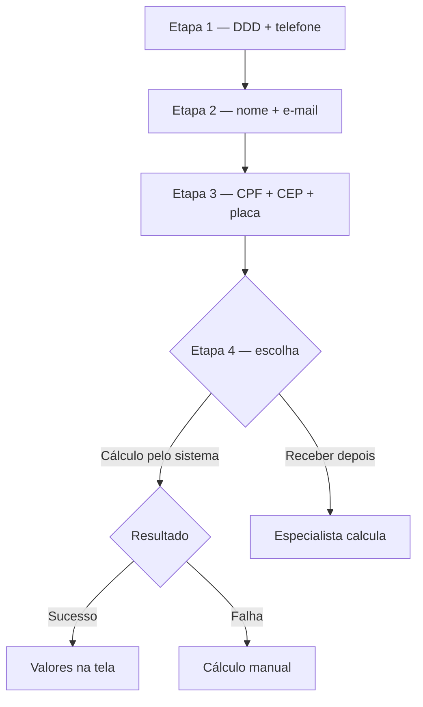
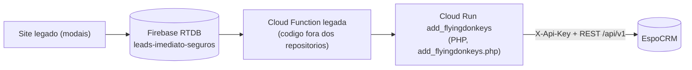

# Fluxo oficial — LeadForm × EspoCRM × WhatsApp (Octadesk)

## Finalidade

Registro do fluxo definido pelo cliente (2026-07-27) para a sequência de preenchimento do formulário de cotação (`LeadForm`), com as ações de CRM (EspoCRM) e de WhatsApp (Octadesk) em cada etapa. Este documento é a **fonte da verdade** do comportamento esperado; a implementação vive em `app/api/lead/route.ts` + `firebase/functions/index.js` (arquitetura em `docs/ARQUITETURA_LEADS_FIREBASE_CLOUD_FUNCTION.md`; templates em `docs/GUIA_OCTADESK_TEMPLATES.md`).

## O fluxo, etapa por etapa

### Etapa 1 — DDD + telefone

- **EspoCRM**: cria o lead com DDD+telefone no campo de telefone, nome e e-mail simulados a partir do número (`{ddd}-{celular}-NOVO CLIENTE WHATSAPP` / `{ddd}{celular}@imediatoseguros.com.br`) — mesmo comportamento dos modais de WhatsApp/telefone. ✅ Já implementado e conferido (2026-07-27): `LeadForm.sendInitialContact()` e `ContactLeadModal` enviam o mesmo `stage:"initial"`; os valores simulados são aplicados na Cloud Function (`buildLegacyProxyPayload`).
- **Octadesk**: envia WhatsApp ao número fornecido com o template **`primeira_etapa_util`** (ID `6a67fa5ce7966478bcf4242a`, criado 2026-07-27) e registra o contato — como nos modais. ✅ Via API direta (`primeira_etapa` no secret), com fallback para o proxy legado.

### Modais WhatsApp / telefone (`ContactLeadModal`) — 2026-07-29

Mesmo `initial` → `primeira_etapa_util`. No `complete`, se o prospect preencheu e-mail, CEP, CPF, placa **ou Nome Completo** (`captureChannel: "contact_modal"`), a CF envia **`cotacao_solicitada_util`** (`cotacao_dados_recebidos` no secret), com `target.contact.name` quando há nome real (`{{nome-contato}}`). Sem dados extras / “ir direto” só com telefone: nenhuma segunda HSM. O `complete` do LeadForm (`captureChannel: "lead_form"`) **não** dispara essa mensagem. A etapa 2 do modal (após o telefone) coleta, opcionalmente e na ordem do legado: CPF → E-mail → Nome Completo → CEP → Placa.

### Etapa 2 — nome + e-mail

- **EspoCRM**: atualiza o lead com nome e e-mail reais (substituindo os simulados) — como os modais fazem na atualização final. ✅ Já implementado (estágio `progress`, 2026-07-20).
- **WhatsApp**: nenhuma mensagem (decisão do cliente).

### Etapa 3 — CPF + CEP + placa

- **EspoCRM**: atualiza o lead com CPF, CEP, placa e dados do veículo (marca/modelo/anos, via Placa Fipe). ✅ Já implementado (estágio `progress`).
- **WhatsApp**: nenhuma mensagem.

### Etapa 4a — cálculo pelo sistema (RPA)

- **Sucesso** → WhatsApp **`opcao_recomendada_util`** (ID `6a679f8fcd5582b40f0b8de2`) com nome/veículo/valor. ✅ Ativo desde 2026-07-27.
- **Falha** → WhatsApp **`calculo_falhou_util`** (ID `6a67b114b134d17c41842d89`). ✅ Ativo.
- **EspoCRM** (dados do cálculo — objeto do plano): campos custom no Lead + resumo na `description` + post no Stream. Ver "Modelo de dados no EspoCRM" abaixo.

### Etapa 4b — receber o cálculo depois

- **WhatsApp** → **`ultima_confirmacao_calculo`** (ID `6a67c99eb2f6c165b3a499f4`). ✅ Ativo.
- **EspoCRM** (objeto do plano): sinalizar ao vendedor que precisa calcular manualmente e enviar ao cliente — via **Task** vinculada ao lead + post no Stream + campo de escolha.

## Modelo de dados no EspoCRM (boas práticas)

Cada mecanismo do EspoCRM tem um papel (prática recomendada de CRM — dado filtrável em campo, história em Stream, ação em atividade):

| Mecanismo | Uso no fluxo | Por quê |
|---|---|---|
| **Campos custom** no Lead | `cEscolhaCalculo`, `cStatusCalculo`, `cValorRecomendado`, `cValorAlternativo` | Filtráveis em listas/relatórios ("todos os leads com cálculo pronto"), visíveis no detail view |
| **Stream (Note)** | 1 post por momento (escolha do passo 4, resultado com valores, pedido de cálculo manual) | Linha do tempo da ficha — o vendedor lê a história em ordem |
| **description** | Resumo consolidado do cálculo | Visível no topo da ficha sem rolar |
| **Task** vinculada ao Lead | "Efetuar cálculo manual e enviar ao cliente" (etapa 4b e falha do RPA) | Acionável: aparece em Atividades/dashboards e não se perde como um post |

### Parametrização no Entity Manager — ✅ EXECUTADA NO DEV em 2026-07-28

**Status**: os 5 campos abaixo + o painel "Cotação do Site" no layout de detalhe foram criados no **dev.flyingdonkeys.com.br** pelo agente (via a camada administrativa autenticada do próprio EspoCRM — endpoints `Admin/fieldManager` e `Lead/layout/detail`, os mesmos que a UI usa), com rebuild executado e verificação visual na ficha de um lead. Achados do processo, importantes para a réplica em produção:

- O Field Manager **prefixa automaticamente "c"** ao nome digitado — para obter `cEtapaFunil`, digite/envie `etapaFunil` (digitar "cEtapaFunil" gera `cCEtapaFunil`).
- Na API, atualização de campo é `PUT Admin/fieldManager/Lead/{name}` com **payload completo** (type/name/label/options) — PATCH retorna 500 e payload parcial pode apagar opções.
- Após criar/alterar: `POST Admin/rebuild` + limpar cache (o client é fortemente cacheado; sem full reload os rótulos novos não aparecem).
- **2026-07-28**: os mesmos 5 campos + painel foram **replicados na Opportunity** do dev (ver item 6c da análise abaixo) — na réplica em produção, criar nas duas entidades.

Campos criados (réplica em produção na virada):

Administração → Entity Manager → Lead → Fields → Add Field:

| Campo | Tipo | Opções |
|---|---|---|
| `cEtapaFunil` | Enum | `""`, `Telefone informado`, `Dados pessoais`, `Dados do veículo`, `Aguardando cálculo`, `Cálculo concluído`, `Cálculo manual pendente` |
| `cEscolhaCalculo` | Enum | `""`, `Aguardar cálculo`, `Receber depois` |
| `cStatusCalculo` | Enum | `""`, `Concluído`, `Falhou`, `Manual solicitado` |
| `cValorRecomendado` | Varchar (30) | — |
| `cValorAlternativo` | Varchar (30) | — |

`cEtapaFunil` é atualizado pela Cloud Function a cada estágio — dá visibilidade de onde cada lead parou (colunas na list view + filtros salvos: "Cálculo pronto — ligar agora", "Cálculo manual pendente", "Abandonou no formulário") e mede abandono por etapa. **Não usar o `status` nativo do Lead para isso** (é o pipeline de vendas; misturar quebraria os relatórios nativos). Recomendado também: adicionar `cEtapaFunil` e `cStatusCalculo` como colunas da list view do Lead.

Depois: Administração → Layout Manager → Lead → Detail → arrastar os 4 campos para um painel "Cálculo do site". (Os campos de veículo — `cMarca`, `cVeiculo`, `cAnoFab`, `cAnoMod`, `cPlaca`, `cCpftext` — já existem no Lead do dev, confirmado em teste real de 2026-07-20.)

### Inventário de campos existentes (fornecido pelo cliente em 2026-07-28, via Gerenciador de Entidades)

#### Entidade Lead — campos custom (`c*`) e nativos relevantes

| Grupo | Campos |
|---|---|
| Identificação | `name` (Nome da Pessoa: `firstName`/`middleName`/`lastName`), `emailAddress`, `phoneNumber`, `cCelular` (Varchar), `cCpftext` (CPF), `accountName`, `title`, `salutationName` |
| Endereço | `address*` (`Street`, `City`, `State`, `Country`, `PostalCode`), `addressMap` |
| Veículo | `cMarca`, `cVeiculo`, `cPlaca` (Texto), `cAnoFab`, `cAnoMod` |
| Seguro | `cModalidade`, `cSegpref` (seguradora preferencial), `cSegant` (seguradora anterior), `cCiapol` (CI apólice anterior), `cValorpret` (Valor Pretendido, Número) |
| Google Ads / UTM | `cGclid`, `cGbraid`, `cGadSource`, `cGadCampaignId`, `cUtmSource`, `cUtmMedium`, `cUtmCampaign`, `cUtmContent`, `cUtmTerm`, `cMatchType`, `cDevice`, `cCreative`, `cAdPosition`, `cPlacement`, `cNetwork` |
| Operação | `cDataDoLead` (Data), `cDistribuir` (Booleano — distribuição p/ equipe), `cWebpage`, `source`, `status` (pipeline de vendas — NÃO usar p/ funil do site), `assignedUser`, `teams`, `campaign`, `description`, `doNotCall`, `opportunityAmount` |
| Conversão | `convertedAt`, `createdAccount`, `createdContact`, `createdOpportunity` |

#### Entidade Opportunity — campos custom e nativos relevantes

| Grupo | Campos |
|---|---|
| Identificação/vínculo | `name`, `cLeadId` (Varchar), `originalLead` (Link), `contact`/`contacts`, `account`, `cCelular`, `cCpftext`, `cEmail` (Texto), `cEmailAdress` (Varchar), `cCEP` |
| Veículo | `cMarca` (Texto), `cVeiculo` (Texto), `cPlaca`, `cAnoFab` (Texto), `cAnoMod` (Texto) |
| Seguro/venda | `cSeguradora` (Lista), `cStatus` (Lista múltipla), `cModalidade`, `cSegpref`, `cSegant`, `cCiapol`, `cValorpret`, `cPremioLiquido` (Moeda), `amount` ("Valor Comissão"), `cComisso` (% comissão), `cApolice` (Arquivo), `cPropostaTransmitida` (Arquivo), `cInicioVigncia`, `cDataDeEmisso`, `cDataVenda`, `cDataCancelamento`, `cApoliceCancelada` |
| Cadência de contato | `cDataprimeirocontato` … `cDataquintocontato`, `cPrimeiraTentativaDeContatoTelefone`, `cConseguiContatarOCliente`, `cDatacotacaoenviada`, `cDataproximodefechar` |
| Processo | `stage` ("Novo Sem Contato" etc.), `lastStage`, `probability`, `closeDate`, `leadSource`, `cDistribuir`, `cWebpage`, `cGclid`, `campaign`, `description`, `cObsGerencia` |

#### Análise do inventário (impactos no plano)

1. **Confirmado**: os 5 campos novos do plano (`cEtapaFunil`, `cEscolhaCalculo`, `cStatusCalculo`, `cValorRecomendado`, `cValorAlternativo`) **não existem** — precisam ser criados no Entity Manager (dev primeiro).
2. **Oportunidade de enriquecimento imediato**: o Lead já tem o **conjunto completo de UTM/Google Ads** (`cUtmMedium/Content/Term`, `cGbraid`, `cGadSource`, `cDevice` etc.), mas o proxy legado só envia `cGclid` — a integração direta deve mapear **todas** as UTMs que o site já captura (`captureUtmFromLocation`), melhorando a atribuição de campanhas no CRM sem custo extra.
3. `cVeiculo` (modelo) e `cAnoFab` existem no Lead — o proxy só preenche `cMarca`/`cAnoMod`; a integração direta preencherá os quatro (temos marca/modelo/anos granulares da Placa Fipe).
4. `cDataDoLead` (Data) existe e não é preenchido pelo proxy — a integração direta preencherá com a data de captura.
5. `cValorpret` ("Valor Pretendido") tem semântica de desejo do cliente, não de resultado de cálculo — mantém-se a decisão de criar `cValorRecomendado`/`cValorAlternativo` em vez de reaproveitá-lo.
6. Na Opportunity, `cLeadId` (Varchar) é o vínculo em texto usado pelo processo atual — a integração direta deve preenchê-lo na criação, além do link nativo `leadId`, para não quebrar relatórios existentes.
6b. **Origem do lead (decisão do cliente, 2026-07-28, valor final confirmado)**: `cWebpage = "comparaseguroonline.com.br"` (o domínio real do site novo) no Lead **e** na Opportunity para todo lead do site novo. O proxy legado grava `mdmidia.com.br` fixo — a Cloud Function sobrescreve via PUT direto (constante `SITE_WEBPAGE` em `firebase/functions/espocrm.js`), e o campo vira o discriminador natural de origem entre os dois sites (filtro/coluna "Webpage" nas listas e relatórios do CRM).
6c. **Campos do funil replicados na Opportunity (2026-07-28)**: os mesmos 5 campos do painel "Cotação do Site" foram criados na **Opportunity** do dev (mesmos nomes/tipos/opções do Lead, painel idêntico no layout de detalhe — feito via edição dos arquivos custom no servidor + rebuild, com backup em `/root/backup-espo-custom-*-pre-opp-fields.tar.gz`). A Cloud Function grava os valores nas **duas** entidades a cada momento (`putEspoFields` + `buildFunnelFields`); como os nomes são idênticos, a conversão nativa Lead → Opportunity do EspoCRM também os copia automaticamente.
7. O campo `status` (Lead) e o `stage`/`cStatus` (Opportunity) são do processo de vendas do time — **intocados**, conforme decidido.

### API User — ✅ RESOLVIDO NO DEV (2026-07-28)

Em vez de criar um usuário novo, foi reutilizado o **`api_dev`** existente (o mesmo que o proxy legado usa no dev; chave copiada do banco do servidor). A Role "API" dele foi ampliada com **Task** (create/read/edit) e **User** (read — exigido para relacionar o `assignedUser` da Task), via ORM do Espo no servidor + clear-cache. Na réplica em produção: ampliar a Role do usuário API de produção com as mesmas permissões.

**Achado do CRM (2026-07-28)**: a entidade Task valida `assignedUser` como **obrigatório** — o responsável vem do bloco do ambiente no secret (`taskAssignedUserId`; no dev é o Admin `68fa40d854b322dfe`). Em produção, o cliente escolhe o usuário que receberá as Tasks de cálculo manual.

### Integração direta ativada — ✅ IMPLEMENTADA E VALIDADA NO DEV (2026-07-28)

Módulos `firebase/functions/espocrm.js` (dedupe por e-mail real → telefone, criação/atualização de Lead + Opportunity com mapeamento completo — todas as UTMs, `cVeiculo`/`cAnoFab`, `cDataDoLead`, `cLeadId` na Opp —, Note, description, Task, campos do funil) e `octadesk.js` (todas as mensagens, incluindo a inicial `primeira_etapa_util`, que NÃO tem variáveis). Orquestração em `index.js` atrás do flag **`useDirect`** no secret `ESPOCRM_API_CONFIG` — bloco `prod` vazio mantém leads de produção no caminho proxy. Mensagem inicial direta tem **fallback automático para o proxy** em caso de falha.

Validação ponta a ponta no dev (2026-07-28): funil "novo prospect" completo (criação direta com UTMs completas, progress em 2 passos, consultant_requested com Task) e funil com o número real do cliente (dedupe de lead antigo, `primeira_etapa` + `calculo_falhou_util` entregues no WhatsApp, Task na falha do RPA).

## Estudo do fluxo legado (segurosimediato.com.br) — 2026-07-27

Fonte real analisada: `imediatoseguros-rpa-playwright/WEBFLOW-SEGUROSIMEDIATO/02-DEVELOPMENT/add_flyingdonkeys.php` (58 KB, o proxy Cloud Run que atende o site legado E o site novo) + `config.php`.

### Como o legado atualiza o lead no EspoCRM

1. **As credenciais do EspoCRM vivem nas variáveis de ambiente do serviço Cloud Run** (`ESPOCRM_URL` + `ESPOCRM_API_KEY`, lidas por `config.php` via `$_ENV`) — não estão em nenhum arquivo local (conferido: `.env.local` e `config/dev_config.php` não as contêm). Para vê-las: Google Cloud Console → Cloud Run → serviço `add-flyingdonkeys-dev` (ou `-prod`) → aba Variáveis.
2. **Autenticação**: header `X-Api-Key` na API REST nativa (`/api/v1/...`) — exatamente o mecanismo já implementado na nossa Cloud Function (`ESPOCRM_API_CONFIG`).
3. **O que o proxy faz por chamada**: deduplicação (GET `Lead` por e-mail e, se não achar, por telefone), criação (`POST /api/v1/Lead`) ou atualização (`PATCH /api/v1/Lead/{id}`), e `PATCH /api/v1/Opportunity/{id}` da oportunidade vinculada. Particularidades documentadas no código: remove campos vazios no PATCH (o EspoCRM rejeita), remove `amount` quando 0 (validação de currency) e trata o "erro" de duplicata do EspoCRM como atualização do lead existente.
4. **Mapeamento de campos confirmado no fonte** (mesmos nomes vistos nas respostas do CRM dev): `firstName`, `emailAddress`, `cCelular`, `addressPostalCode`, `addressCity/State/Street`, `addressCountry: "Brasil"`, `cCpftext`, `cMarca`, `cPlaca`, `cAnoMod`, `cGclid`, `cWebpage`, `source: "Site"`.

### Implicação para o plano

- A **API key do EspoCRM já existe** (é a que o Cloud Run usa há anos). Em vez de criar um API User novo, uma opção pragmática é **reutilizar a mesma chave**, copiando `ESPOCRM_URL`/`ESPOCRM_API_KEY` das variáveis do serviço Cloud Run dev no Google Cloud Console para o secret `ESPOCRM_API_CONFIG` — nossa CF passa a ter o mesmo nível de acesso que o proxy legado já tem. (Criar um API User separado continua sendo a prática mais limpa para auditoria; as duas opções funcionam.)
- Os campos custom novos do plano (`cEscolhaCalculo`, `cStatusCalculo`, `cValorRecomendado`, `cValorAlternativo`) seguem a mesma convenção `c*` dos existentes.
- Lição do proxy a replicar na nossa CF ao gravar campos: **nunca enviar campos vazios em PATCH/PUT** (o EspoCRM pode rejeitar o request inteiro).

## Ambientes

- Desenvolvimento: `dev.flyingdonkeys.com.br` — usado enquanto `environment` ≠ `production`.
- **Produção (virada Fase A 2026-07-29):** com `NEXT_PUBLIC_APP_ENV=production`, a CF entrega no proxy `ESPOCRM_PROD_URL` → **`flyingdonkeys.com.br`**. Smoke: Lead `6a6a00312d24538d3` / Opp `6a6a00317e6f598bc` (apagar na UI prod). Campos funil (`cEtapaFunil` etc.) ainda precisam ser espelhados no prod antes da onda 2 (API direta). Ops: `docs/FASE_A_GTM_ESPOCRM_OPS.md`.
- Produção: replicar as parametrizações manuais (campos, layout, API User) e atualizar o secret quando o fluxo for aprovado no dev.
