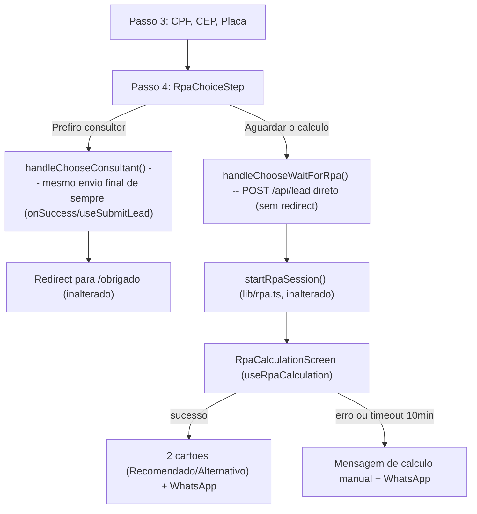

# Etapa de decisão RPA no formulário

## Finalidade
Documentar o passo 4 do `LeadForm` (decisão "aguardar o cálculo" vs. "falar com consultor depois") e a mecânica de acompanhamento do RPA — para referência futura, sem precisar reler o código a cada dúvida.

## Origem
Pedido do cliente em 2026-07-16: adicionar, depois de CPF/CEP/Placa, uma etapa perguntando se o usuário quer aguardar o cálculo automático (RPA, 18 seguradoras, 2 a 10 minutos) ou preferir que um consultor calcule depois — reproduzindo a mecânica de progresso/timer/resultado já existente no site legado (`webflow_injection_limpo.js`), mas com código novo (só deste projeto) e visual do novo site.

## Status
CONCLUÍDO.

## O que existia antes

`useSubmitLead` (`lib/leads/use-submit-lead.ts`) disparava o RPA de forma "cosmética" — só um `sleep` fixo de 4s enquanto `RPAProgressModal` mostrava um spinner genérico, sem exibir nenhum resultado real. Isso foi completamente removido nesta rodada.

## Investigação do site legado (`webflow_injection_limpo.js`)

Análise **só de leitura** (nada alterado no arquivo legado, no ecossistema `imediatoseguros-rpa-playwright`, nem no backend/motor do RPA em `rpaimediatoseguros.com.br`):

- **16 fases** de progresso (`phaseMessages`/`phaseSubMessages`/`phasePercentages`), cada uma valendo 6,25% (`fase/16 × 100`).
- **Timer visual**: 3 minutos iniciais, com 1 extensão automática de +2 minutos se o cálculo ainda não terminou.
- **Polling**: `GET /api/rpa/progress/{sessionId}` a cada 2s, até 300 tentativas (10 minutos) — depois disso, timeout.
- **Resultado final**: 2 planos, `plano_recomendado`/`plano_alternativo`, extraídos de 3 estruturas de fallback possíveis na resposta da API (formatos antigo e novo). Campos: forma de pagamento, parcelamento, valor de mercado, franquia (valor + tipo), assistência/vidros/carro reserva (booleanos), danos materiais/corporais/morais, morte e invalidez, e o valor de destaque.
- **Erro/timeout**: qualquer falha (start, polling, timeout, status de erro do backend) sempre cai na mesma mensagem genérica ("Cotação Manual Necessária") — nunca mostra os códigos de erro específicos ao usuário.
- **Sem botões de ação pós-resultado** no legado (CSS morto, nunca usado) — a tela de resultado com botão de WhatsApp é uma criação genuína deste projeto, não uma réplica.

## O que foi construído

Tudo em código novo, só neste repositório (Vercel), consumindo os mesmos endpoints já existentes em `lib/rpa.ts` (`startRpaSession`/`fetchRpaProgress`/`buildRpaPayload` — **sem alteração de contrato**):

- **`lib/rpa-calculation.ts`** — mapa das 16 fases (títulos/subtítulos sem emoji), cálculo de percentual, tipos `RpaPlano`/`RpaFinalResult`, `parseRpaFinalResult()` (3 estruturas de fallback), `isRpaErrorStatus()`/`isRpaSuccessStatus()` (versão simplificada, sem a tabela interna de códigos 1000–9999 do legado — nenhuma dessas mensagens específicas chega a ser mostrada ao usuário).
- **`lib/leads/use-rpa-calculation.ts`** — hook com a máquina de estados (`idle`/`starting`/`progress`/`success`/`error`), polling (2s/10min) e timer (3+2min).
- **`components/lead/RpaChoiceStep.tsx`** — passo 4: texto explicando o tempo estimado (2 a 10 minutos) e as 2 opções ao final (recomendada + alternativa), 2 botões (`Aguardar o cálculo` / `Falar com um consultor depois`), disclaimer sobre a contratação (feita pelo consultor após a proposta da seguradora, sujeita à aprovação da seguradora).
- **`components/lead/RpaResultCard.tsx`** — 1 cartão de plano (Recomendado/Alternativo).
- **`components/lead/RpaCalculationScreen.tsx`** — 3 sub-telas (calculando / sucesso com os 2 cartões / erro com a mensagem de cálculo manual), cada uma com botão de WhatsApp (`skipModal`, mesmo padrão de `ObrigadoContent`) — **sem redirect automático**, decisão do cliente: o usuário permanece na tela de resultado.

## Fluxo

## Decisões e limites

- **Sem redirect automático** ao concluir (sucesso ou erro) — o usuário só sai clicando no botão de WhatsApp ou navegando manualmente.
- **`buildRpaPayload`** (DDD, celular, nome, CPF, CEP, placa, produto) não foi alterado — marca/modelo/ano do veículo (`veiculoMarca` etc., ver `lib/leads/types.ts`) continuam fora do payload do RPA, integração futura.
- **`NEXT_PUBLIC_RPA_ENABLED`** continua controlando se `startRpaSession` de fato funciona em produção — a opção "Aguardar o cálculo" só calcula de verdade com essa flag ligada (ver `docs/PROXIMOS_PASSOS.md`).
- **`ContactLeadModal`** (modal de WhatsApp/telefone) não recebeu esta etapa — só o `LeadForm` (fluxo em passos).
- **`RPAProgressModal.tsx`** (modal cosmético antigo) foi removido — substituído por `RpaCalculationScreen`, embutido no próprio `LeadForm`.

## Disclosure de perfil estimado (2026-07-17)

O passo 4 (`RpaChoiceStep`) passou a exibir, antes de "Aguardar o cálculo", um aviso de que **parte do perfil é estimada pelo sistema** (constante `RPA_PROFILE_ESTIMATE_NOTICE` em `lib/rpa-calculation.ts`):

> "Para agilizar o cálculo, alguns dados do seu perfil — como composição familiar, estado civil e a forma de guarda do veículo — são estimados automaticamente pelo sistema com base na média. Na formalização da proposta com a seguradora, esses dados serão confirmados e o valor final pode mudar."

Motivo: o teste de fidelidade (abaixo) confirmou que, quando o site envia apenas os campos do `buildRpaPayload` (DDD/celular, nome, CPF, CEP, placa, produto), o backend `rpaimediatoseguros.com.br` **estima o restante do perfil** — via PH3A (sexo/data de nascimento/estado civil a partir do CPF, quando ausentes) e defaults próprios (condutor, garagem, uso, combustível, etc.). Isso muda o prêmio em relação a um cálculo com o perfil completo. O disclosure alinha a expectativa do cliente.

## Teste de fidelidade RPA (local vs. site)

- Objetivo (revisado 2026-07-17): verificar que **as duas execuções (motor local e site) percorrem todas as etapas e apresentam o cálculo final** — **não** comparar igualdade de valores.
- A diferença de valor entre as pontas é **esperada e legítima**: prova experimental (`scripts/experimento_divergencia.py`) mostrou que, enviando o payload completo ao backend, o valor bate com o local ao centavo (R$696,24/R$950,47); com o payload mínimo, o backend estima o perfil e o valor sobe (R$3.892,16/R$4.342,92). Mesmo motor; muda só a entrada.
- Comparador `scripts/comparar_resultados.py`: categorias `CALCULO_OK_AMBOS` (alvo), `MANUAL_AMBOS`, `DIVERGENTE_STATUS`, `FALHA_EXECUCAO`; valores gravados apenas como informativo.
- Correção de integração encontrada pelo teste: o start do RPA responde `session_id` (snake_case) — `lib/rpa.ts` foi ajustado para ler `session_id` (antes lia `sessionId` e toda cotação pelo site caía em "cálculo manual").

## Estado civil por idade + contador de etapas + teaser (2026-07-17)

### Estado civil derivado da PH3A
Na opção "Aguardar o cálculo", o site passou a enviar ao RPA um **bloco demográfico** (`sexo`, `data_nascimento`, `estado_civil`) derivado da PH3A, para suprimir a estimativa própria do backend:

- A chamada `/api/lead` (`stage: "complete"`), que o `LeadForm` já faz antes do RPA, agora executa a PH3A (`enrichLeadWithPh3a`, que passou a **retornar** o resultado) e devolve `perfilRpa = { sexo, dataNascimento, estadoCivil }` na resposta.
- **Regra de estado civil por idade** (`lib/perfil-rpa.ts`, `estadoCivilPorIdade`): idade `< 25` → `"Solteiro"`; `>= 25` → `"Casado ou União Estável"`. A idade vem da data de nascimento da PH3A.
- `handleChooseWaitForRpa` lê `perfilRpa` e repassa ao `buildRpaPayload`, que emite `sexo`/`data_nascimento`/`estado_civil` (snake_case, formato `DD/MM/AAAA`).
- **Fallback**: sem CPF, sem PH3A (`PH3A_ENRICHMENT_ENABLED=false`) ou sem data de nascimento, o bloco não é enviado e o backend estima o perfil, como antes.
- **Pré-requisito** para funcionar: `PH3A_ENRICHMENT_ENABLED=true` e `CPF_VALIDATE_PROXY_URL` válido.

### Contador de etapas e teaser
- O `LeadForm` agora exibe "Etapa X de 3" nos passos de coleta (1 a 3); a tela de escolha (passo 4) **não** é contada (`COLLECTION_STEPS = 3`, mantendo `TOTAL_STEPS = 4` para a navegação).
- A `ProgressBar` reflete as 3 etapas e é ocultada no passo 4; o texto do contador vive no cabeçalho (visível também no Hero, onde a barra é `compact`).
- Teaser discreto nos passos 1-3: "Poucos dados por etapa — cada uma leva de 15 a 30 segundos."
