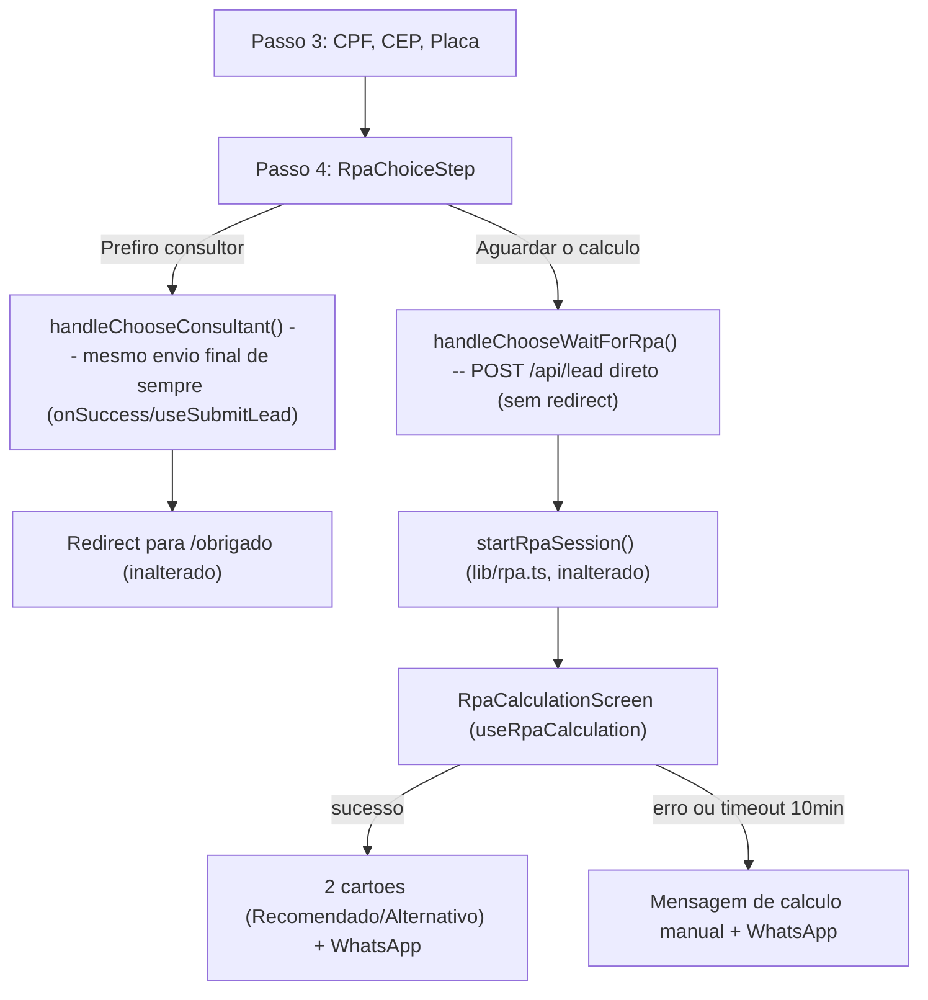

# Etapa de decisão RPA no formulário

## Finalidade
Documentar o passo 4 do `LeadForm` (decisão "aguardar o cálculo" vs. "falar com consultor depois") e a mecânica de acompanhamento do RPA — para referência futura, sem precisar reler o código a cada dúvida.

## Origem
Pedido do cliente em 2026-07-16: adicionar, depois de CPF/CEP/Placa, uma etapa perguntando se o usuário quer aguardar o cálculo automático (RPA, 18 seguradoras, 2 a 10 minutos) ou preferir que um consultor calcule depois — reproduzindo a mecânica de progresso/timer/resultado já existente no site legado (`webflow_injection_limpo.js`), mas com código novo (só deste projeto) e visual do novo site.

## Status
CONCLUÍDO.

## O que existia antes

`useSubmitLead` (`lib/leads/use-submit-lead.ts`) disparava o RPA de forma "cosmética" — só um `sleep` fixo de 4s enquanto `RPAProgressModal` mostrava um spinner genérico, sem exibir nenhum resultado real. Isso foi completamente removido nesta rodada.

## Investigação do site legado (`webflow_injection_limpo.js`)

Análise **só de leitura** (nada alterado no arquivo legado, no ecossistema `imediatoseguros-rpa-playwright`, nem no backend/motor do RPA em `rpaimediatoseguros.com.br`):

- **16 fases** de progresso (`phaseMessages`/`phaseSubMessages`/`phasePercentages`), cada uma valendo 6,25% (`fase/16 × 100`).
- **Timer visual**: 3 minutos iniciais, com 1 extensão automática de +2 minutos se o cálculo ainda não terminou.
- **Polling**: `GET /api/rpa/progress/{sessionId}` a cada 2s, até 300 tentativas (10 minutos) — depois disso, timeout.
- **Resultado final**: 2 planos, `plano_recomendado`/`plano_alternativo`, extraídos de 3 estruturas de fallback possíveis na resposta da API (formatos antigo e novo). Campos: forma de pagamento, parcelamento, valor de mercado, franquia (valor + tipo), assistência/vidros/carro reserva (booleanos), danos materiais/corporais/morais, morte e invalidez, e o valor de destaque.
- **Erro/timeout**: qualquer falha (start, polling, timeout, status de erro do backend) sempre cai na mesma mensagem genérica ("Cotação Manual Necessária") — nunca mostra os códigos de erro específicos ao usuário.
- **Sem botões de ação pós-resultado** no legado (CSS morto, nunca usado) — a tela de resultado com botão de WhatsApp é uma criação genuína deste projeto, não uma réplica.

## O que foi construído

Tudo em código novo, só neste repositório (Vercel), consumindo os mesmos endpoints já existentes em `lib/rpa.ts` (`startRpaSession`/`fetchRpaProgress`/`buildRpaPayload` — **sem alteração de contrato**):

- **`lib/rpa-calculation.ts`** — mapa das 16 fases (títulos/subtítulos sem emoji), cálculo de percentual, tipos `RpaPlano`/`RpaFinalResult`, `parseRpaFinalResult()` (3 estruturas de fallback), `isRpaErrorStatus()`/`isRpaSuccessStatus()` (versão simplificada, sem a tabela interna de códigos 1000–9999 do legado — nenhuma dessas mensagens específicas chega a ser mostrada ao usuário).
- **`lib/leads/use-rpa-calculation.ts`** — hook com a máquina de estados (`idle`/`starting`/`progress`/`success`/`error`), polling (2s/10min) e timer (3+2min).
- **`components/lead/RpaChoiceStep.tsx`** — passo 4: texto explicando o tempo estimado (2 a 10 minutos) e as 2 opções ao final (recomendada + alternativa), 2 botões (`Aguardar o cálculo` / `Falar com um consultor depois`), disclaimer sobre a contratação (feita pelo consultor após a proposta da seguradora, sujeita à aprovação da seguradora).
- **`components/lead/RpaResultCard.tsx`** — 1 cartão de plano (Recomendado/Alternativo).
- **`components/lead/RpaCalculationScreen.tsx`** — 3 sub-telas (calculando / sucesso com os 2 cartões / erro com a mensagem de cálculo manual), cada uma com botão de WhatsApp (`skipModal`, mesmo padrão de `ObrigadoContent`) — **sem redirect automático**, decisão do cliente: o usuário permanece na tela de resultado.

## Fluxo

## Decisões e limites

- **Sem redirect automático** ao concluir (sucesso ou erro) — o usuário só sai clicando no botão de WhatsApp ou navegando manualmente.
- **`buildRpaPayload`** (DDD, celular, nome, CPF, CEP, placa, produto) não foi alterado — marca/modelo/ano do veículo (`veiculoMarca` etc., ver `lib/leads/types.ts`) continuam fora do payload do RPA, integração futura.
- **`NEXT_PUBLIC_RPA_ENABLED`** continua controlando se `startRpaSession` de fato funciona em produção — a opção "Aguardar o cálculo" só calcula de verdade com essa flag ligada (ver `docs/PROXIMOS_PASSOS.md`).
- **`ContactLeadModal`** (modal de WhatsApp/telefone) não recebeu esta etapa — só o `LeadForm` (fluxo em passos).
- **`RPAProgressModal.tsx`** (modal cosmético antigo) foi removido — substituído por `RpaCalculationScreen`, embutido no próprio `LeadForm`.
