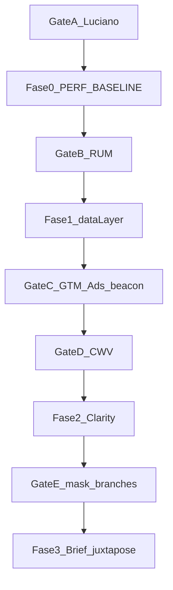

# Plano: telemetria UX (Fases 0–3)

**Status:** Fase 0 OK. Fase 1 em prod. Gate C OK (GTM v49 + smoke). **Gate D em curso** (SI 7d desde 2026-09-11 → ~18/set).  
**Próximos passos (operacional):** [PROXIMOS_PASSOS_UX_TELEMETRIA.md](PROXIMOS_PASSOS_UX_TELEMETRIA.md).  
**Escopo:** site novo `novo.segurosimediato.com.br` (braço Exp). Legado fora.  
**Fonte canônica no repo:** este arquivo (`docs/UX_TELEMETRIA_PLAN.md`). O espelho em `.cursor/plans/` deve conter só ponteiro para cá — não duplicar o texto.  
**Atualizado:** 2026-09-12 — doc próximos passos + release v0.2.47.

---

## Objetivo

Instrumentar comportamento real do funil em fases isoladas, com Core Web Vitals antes/depois de cada fase, sem alterar conversão Ads do passo 1 nem Espo/Octadesk — gerando brief para auditoria externa (Fase 3).

---

## Decisões técnicas fechadas (eng)

| Tema | Decisão |
|------|--------|
| Pipeline padrão | `trackEvent` → `dataLayer` → GTM → GA4 ([lib/analytics.ts](../lib/analytics.ts)). Sem SDK GA4 no app. |
| Unload / abandon | **Opção A (sem Measurement Protocol):** continua `dataLayer.push` no `pagehide`; Gate C exige que as tags GA4 de `form_abandon` e `form_step_timing` (leave) usem transporte compatível com saída de página (beacon). Sem caminho de rede paralelo na Fase 1. Se Preview/prod mostrarem perda sistemática no iOS, abrir PR 1.1 com exceção documentada (não misturar na 1ª PR). |
| Timing | Evento **novo** `form_step_timing` — não alterar payload/semântica de `form_step` |
| `focus_field` whitelist | **Fechada:** `ddd`, `celular`, `nome`, `email`, `cpf`, `cep`, `placa`. Fora da lista → `focus_field: "other"` (ou omitir). Nunca enviar `value`. Nome do campo ≠ PII de valor. |
| Abandon × RPA | **Complementares, não substitutos.** `form_abandon` = saiu da jornada sem completar funil. `rpa_wait_end(outcome: abandon)` = interrompeu espera do RPA. Brief Fase 3 **não soma** os dois como duas quedas de funil; taxa de abandono do funil usa só `form_abandon`; métricas de espera usam só `rpa_wait_*`. |
| RPA | `rpa_wait_start` / `rpa_wait_end` com `wait_ms` + `outcome: success\|error\|abandon` |
| Scroll | Série `scope: "page"` (25/50/75/90) mantida; `scope: "below_hero"` (25/50/75/100) só se existir `[data-hero]`; senão no-op |
| Clarity load | `next/script` `afterInteractive`; só se **todas:** `VERCEL_ENV=production`, `NEXT_PUBLIC_CLARITY_ID`, sample hit, consent analytics allowed, cookie kill **ausente** |
| Clarity consent (wire) | `ClarityScript` lê `localStorage` key `imediato_consent` (mesmo contrato do [ConsentBanner](../components/consent/ConsentBanner.tsx)). Se `analytics === false` → **não** injeta. Se key ausente → trata como granted (paridade opt-out do GTM). Não bastar “existir banner no site”. |
| Clarity sample | Sorteio **uma vez por visitante** em `localStorage` (`imediato_clarity_sample` = `0`\|`1`). Não re-sortear a cada pageview. Taxa: **5%** nas primeiras 48h pós-deploy F2; depois **20%** só para **novos** sorteios (já sorteados em 5% permanecem até limpar storage). |
| Clarity kill | Cookie `imediato_clarity_off=1` (instantâneo) → Instant Rollback → limpar ID + redeploy |
| Clarity mask | Projeto Clarity + `data-clarity-mask` em tel/CPF/e-mail/placa (LeadForm + ContactLeadModal), **todos** os ramos de render |
| Clarity tags | `clarity("set", "form_step", …)`, `rpa_active` |
| Escopo | Hostname novo only; briefs “Exp only” |
| Deploys | 1 fase = 1 PR; freeze 7 dias na medição; Fase 1 = 1 PR com commits/seções lógicas (ver abaixo) |
| Ads Δ15% | Heurística, **não** teste de significância; FP/FN esperados com n~dezenas–100/semana |

### Contrato de eventos (Fase 1)

```
form_step_timing: { form_id, step: 1|2|3|4, action: "enter"|"leave", dwell_ms?, ramo? }
form_abandon:     { form_id, last_step, max_step, reason, ramo?, had_initial_contact,
                    focus_field?: "ddd"|"celular"|"nome"|"email"|"cpf"|"cep"|"placa"|"other",
                    had_filled_field: boolean }
rpa_wait_start:   { ramo }
rpa_wait_end:     { ramo, wait_ms, outcome: "success"|"error"|"abandon" }
scroll_depth:     { percent: 25|50|75|90|100, page_path, scope: "page"|"below_hero" }
```

---

## O que o código já tem (não reinventar)

- `<SpeedInsights />` em [app/layout.tsx](../app/layout.tsx) — campo depende de Pro/enable (Gate A).
- GTM `afterInteractive` + Consent Mode opt-out ([GtmConsentScripts.tsx](../components/consent/GtmConsentScripts.tsx), [ConsentBanner.tsx](../components/consent/ConsentBanner.tsx)).
- Funil: `form_start`, `form_step`, `form_initial_contact`, `form_quote_choice`, `generate_lead`.
- `form_abandon` sem `focus_field` ([analytics-funnel.ts](../lib/analytics-funnel.ts)).
- `scroll_depth` / `engaged_time` página inteira ([PageAnalytics.tsx](../components/analytics/PageAnalytics.tsx)).
- Sem Clarity/Hotjar. Octadesk = backend.
- [BASELINE_METRICS.md](BASELINE_METRICS.md) = lab histórico; comparação por fase = [PERF_BASELINE.md](PERF_BASELINE.md) (criar na F0).

## Restrições absolutas

- Não alterar `form_initial_contact` / `sendInitialContact()` / Espo / Octadesk / copy RPA.
- Eventos novos Fase 1: **somente tags GA4**, nunca Ads.
- Scripts: `afterInteractive` ou `lazyOnload` apenas.
- Sem Measurement Protocol / fetch paralelo na Fase 1 (exceção só em 1.1 se Gate C provar perda).



---

## Gates (Luciano)

### Gate A — antes de fechar F0 / código F1–F2

1. SI em produção com dados? Se não: Pro **ou** waiver PSI-only (Fase 2 bloqueada sem SI salvo waiver extra).
2. CSP/WAF externo bloqueia `clarity.ms`?
3. Consent Clarity = categoria **Analytics** (wire = leitura de `imediato_consent` no script).
4. Privacidade/banner atualizados **antes** da Fase 2? (**Bloqueante** por default.)
5. Freeze de campanha/criativo nas janelas de 7 dias? Experimento URL continua?

### Gate B — F0 → F1

- `PERF_BASELINE.md` preenchido.
- SI: ≥7d RUM **ou** ≥1000 PVs em `/` + `/cotacao` (se SI ativo).
- PSI lab mobile+desktop nesses paths.

### Gate C — F1 verde (código + GTM)

- Tags GA4 dos eventos novos publicadas (hostname novo).
- **Transport unload:** confirmar no GTM Preview (e doc do container) que hits de `form_abandon` / `form_step_timing` leave partem em pagehide/aba oculta (beacon); se falhar no Safari/iOS, registrar e abrir PR 1.1 — não inventar MP na mesma PR.
- Ads: 1 ping formulário/jornada no passo 1; 0 ping nos eventos novos.
- Volume Ads passo 1: alerta se Δ &gt;15% vs média 7d — **heurística**; investigar se persistir 2–3 dias ou coincidir com deploy/GTM; árbitro não trata como determinístico.
- Dono pause GTM &lt;15 min nomeado no `PERF_BASELINE.md`.

### Gate D — CWV

p75 SI nos paths do gate:

- LCP: não piora &gt;200 ms **e** não sai de good (&lt;2.5s) se já good.
- INP: não piora &gt;50 ms.
- CLS: não piora &gt;0.05.

SI prevalece sobre PSI quando Gate B ok. Árbitro: Luciano.

Se Gate D falhar na Fase 1: hipótese #1 = listener de scroll; #2 = trabalho síncrono no abandon; bissectar pelos commits lógicos do PR.

### Gate E — pós Clarity (mask + branches)

Gate D + roteiro de gravações de teste (mín. 3–5), **todos** os caminhos:

1. LeadForm passos 1→4 (campos ddd/celular → nome/email → cpf/cep/placa → escolha).
2. Abrir ContactLeadModal WhatsApp e telefone (campos sensíveis).
3. Tela RPA (se acessível em teste).
4. Voltar etapa / re-mount (garantir mask após re-render).

**Passou** = nenhum CPF/telefone/e-mail/placa legível no replay. Só então subir sample para 20% (novos sorteios).

---

## Fase 0 — Baseline

**Código:** nenhum. **Status:** lab + `PERF_BASELINE.md` feitos em 2026-09-11.

1. Gate A — **parcial** (pendências SI/Pro, privacidade, freeze no `PERF_BASELINE.md`).  
2. Lab `/` e `/cotacao` (mobile+desktop) — **feito** via Lighthouse CLI (API PSI 429); resumos em `docs/_psi_fase0/sum-*.json`.  
3. Snapshot SI — **pendente** (painel Vercel).  
4. [PERF_BASELINE.md](PERF_BASELINE.md) — **feito**.  
5. Gate B antes de PR Fase 1 — **pendente**.

---

## Fase 1 — Funil (zero terceiros)

**Status código:** implementado 2026-09-11. **Um PR**, commits/seções nesta ordem (para bissectar Gate D):

1. Contrato + `form_step_timing` — feito (`lib/analytics.ts`)
2. Enrich `form_abandon` + whitelist + dataLayer no pagehide — feito (`lib/analytics-funnel.ts`, `LeadForm`)
3. `rpa_wait_*` — feito (`LeadForm` effects)
4. `data-hero` + scroll `below_hero` — feito (`Hero`, `PageAnalytics`)

### Call sites

- [LeadForm.tsx](../components/lead/LeadForm.tsx): timing; abandon; **não** tocar `sendInitialContact`.
- RPA: wait start/end no LeadForm; pagehide durante RPA → `rpa_wait_end(abandon)` **e** `form_abandon` (complementares).
- [Hero.tsx](../components/home/Hero.tsx): `data-hero`.
- [PageAnalytics.tsx](../components/analytics/PageAnalytics.tsx): below-hero só com `[data-hero]`.

### GTM

Só GA4; Gate C **publicado** via `gtm-apply-ux-fase1.mjs` (versão Live “UX Fase 1 — Gate C GA4”). Transport = gaawe padrão (beacon no unload; validar Preview iOS se necessário).

**Saída:** eventos no GA4; Gate D (7d SI) → coluna pós-F1.

---

## Fase 2 — Clarity

Após Gate A (privacidade) + Gate D da F1.

- `components/analytics/ClarityScript.tsx` no layout.
- Condições: prod + ID + sample localStorage + consent wire + sem cookie kill.
- Mask + custom tags.
- Env Production: `NEXT_PUBLIC_CLARITY_ID` (não Preview).
- 48h @ 5% → Gate E (roteiro branches) → 20% novos sorteios.
- Regressão: cookie kill e/ou Instant Rollback.

**Saída:** coluna pós-F2; Gate E.

---

## Fase 3 — Brief (justaposição, não join)

Sem client ID compartilhado GA4↔Clarity nesta fase.

Método obrigatório no [UX_AUDIT_BRIEF.md](UX_AUDIT_BRIEF.md):

1. Ranking de abandono por `last_step` / `focus_field` (só `form_abandon`).  
2. Dwell por etapa (`form_step_timing`).  
3. Distribuição `rpa_wait_end` (success/error/abandon + p50/p90 `wait_ms`) — **separado** do funil.  
4. Para cada etapa com maior abandono: amostrar gravações Clarity filtradas por custom tag `form_step=N` na mesma janela de datas.  
5. Seção “Limitações”: sample, consent, Exp-only, adblock, **evidências paralelas (sem join de sessão)**.

Gate contratar auditor: brief + baselines assinados.

---

## Checklist Ads

- [ ] Nenhuma tag Ads nova  
- [ ] `form_initial_contact` Ads intacta  
- [ ] Preview: 1 conversão passo 1; zero nos eventos novos  
- [ ] Volume 24–48h vs média 7d (alerta heurístico &gt;15%)  
- [ ] Dono pause &lt;15 min nomeado  
- [ ] Transport unload das tags de abandon/timing verificado  

## Rollback

| Fase | Ação |
|------|------|
| 1 | Instant Rollback / revert; pausar tags GA4 novas |
| 2 | Cookie kill → Instant Rollback → limpar ID + redeploy |
| 1.1 (só se preciso) | Exceção beacon/MP documentada; revertível à parte |

## Ordem de execução

1. Luciano: Gate A.  
2. Fase 0 only.  
3. Gate B → PR Fase 1 → C/D.  
4. Privacidade ok → PR Fase 2 → E.  
5. Fase 3 → brief.

## Entregável pós-fase

O que mudou; envs; CWV vs F0; gates; próximo passo liberado ou bloqueado.

---

## Achados 2ª revisão → correção (resumo)

| # | Achado | Correção neste doc |
|---|--------|-------------------|
| 1 | Beacon vs dataLayer | Opção A + Gate C transport; 1.1 só se perda |
| 2 | Duplo abandon RPA | Complementares; brief não soma |
| 3 | Ads 15% frágil | Caveat heurístico + persistência 2–3d |
| 4 | Sem correlação F3 | Justaposição por etapa/data explícita |
| 5 | Sample por pageview | localStorage por visitante |
| 6 | Mask branches | Roteiro Gate E |
| 7 | Consent aspiracional | Wire `imediato_consent` no ClarityScript |
| 8 | Whitelist aberta | Lista fechada no contrato |
| 9 | PR monolítico | Commits lógicos + hipóteses Gate D |
| 10 | Espelho divergente | Fonte única = este arquivo |
