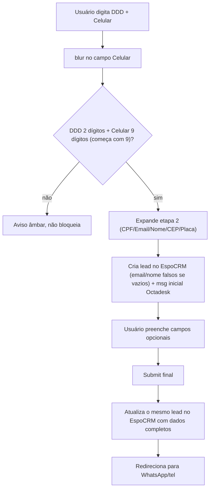

# Validação em tempo real (CPF/celular/e-mail) + captura em 2 fases

## Finalidade
Documentar a arquitetura implementada em 2026-07-13 para replicar, no site novo, o comportamento de:
1. **Captura em 2 fases** do modal legado (`MODAL_WHATSAPP_DEFINITIVO.js`) — contato inicial só com telefone, depois atualização com os dados completos.
2. **Validação em tempo real** do formulário principal legado (`webflow_injection_limpo.js`) — CPF (checksum local), celular (APILayer) e e-mail (SafetyMails).

Aplicado nos dois pontos de captura de lead do site novo: `ContactLeadModal` (modal de WhatsApp/telefone) e `LeadForm` (formulário multi-step de `/cotacao` e do Hero).

## Diferença deliberada em relação ao legado (segurança)
No site legado, as chamadas à APILayer e ao SafetyMails são feitas **direto do navegador**, expondo `APILAYER_KEY`/`SAFETY_TICKET`/`SAFETY_API_KEY` no JavaScript público. No site novo, essas chamadas passam por proxies server-side (`app/api/validate/phone`, `app/api/validate/email`) — mesma credencial, nunca exposta ao client.

---

## Comportamento do site legado (análise, 2026-07-13)

### Modal (`MODAL_WHATSAPP_DEFINITIVO.js`) — captura em 2 fases

- E-mail "falso" quando vazio: `{ddd}{celular}@imediatoseguros.com.br`.
- Nenhuma validação via SafetyMails/APILayer/checksum de CPF acontece dentro do modal — só formato local.

### Formulário principal (`webflow_injection_limpo.js`) — validação em tempo real
- `validateCPF`: formato + checksum dos dígitos verificadores, 100% local.
- `validateCelular`: formato local + validação opcional via APILayer.
- `validateEmail`: formato local + SafetyMails.
- No submit final, se algum campo tiver erro: `SweetAlert` com **"Corrigir"** (foca o campo, bloqueia envio) vs. **"Prosseguir assim mesmo"** (envia o lead sem cotação automatizada).

---

## Arquitetura implementada no site novo

### Fase A — Validação local (`lib/validators.ts`)
- `isValidCpf()`: checksum dos dígitos verificadores (mesmo algoritmo do legado), exportado e usado pelo schema Zod (`cpf.refine()`) — CPF continua opcional (vazio é válido), mas se preenchido precisa passar o checksum.
- `celular`: regex mais estrita (`/^9\d{8}$/`) — sempre 9 dígitos começando em "9", alinhado ao `validarCelularLocal` do legado (antes aceitava 8 ou 9 dígitos, sem exigir o "9").

### Fase B — Proxies server-side (`app/api/validate/*`)
| Rota | Lógica | Credenciais |
|---|---|---|
| `POST /api/validate/phone` | `lib/validation/phone-apilayer.ts` — formato local + APILayer Number Verification | `APILAYER_KEY`, `APILAYER_BASE_URL` |
| `POST /api/validate/email` | `lib/validation/email-safetymails.ts` — formato local + SafetyMails (POST+HMAC) | `SAFETY_TICKET`, `SAFETY_API_KEY`, `SAFETYMAILS_BASE_DOMAIN` |

Ambas as rotas reaproveitam `checkRateLimit`/`hashIp` de `lib/leads/security.ts` (mesma proteção de `/api/lead`) e rodam em modo mock (`ok: true`) sem as credenciais configuradas.

**Achado 2026-07-13 (testado com credenciais reais):**
- **APILayer**: funciona — resposta real confirmada (`valid: true`, `carrier`, `line_type`).
- **SafetyMails**: as 2 variantes conhecidas (GET+base64 do formulário principal; POST+HMAC do FooterCode) **não respondem** — uma retorna HTTP 400 `"Função descontinuada - Procure o Suporte"`, a outra tem erro de DNS (`ENOTFOUND {ticket}.safetymails.com`), testado com o ticket de DEV e também o de PRODUÇÃO. Esse problema já está documentado como não resolvido no próprio projeto legado (`INVESTIGACAO_ERRO_403_SAFETYMAILS.md`, `ANALISE_COMPARATIVA_SAFETYMAILS.md`) — não é específico do site novo. Implementado mesmo assim (decisão do cliente, 2026-07-13): a chamada é tentada de verdade, mas **nunca bloqueia** o usuário se falhar (mesma filosofia de "falha aberta" do `validateEmail` legado).

### Fase C — Captura em 2 fases no backend (`/api/lead`)
- `LeadRecord.stage: "initial" | "complete"` + `espocrmLeadId`/`espocrmOpportunityId` (`lib/leads/types.ts`).
- `apiLeadSchema` aceita `stage` e `leadId` no corpo da requisição.
- `app/api/lead/route.ts`:
  - `stage: "initial"` — valida DDD+Celular, cria o lead, dispara EspoCRM+Octadesk em paralelo (mesma infraestrutura de `sendLeadWebhook`), devolve `{leadId}`. Se já existe um registro com o mesmo telefone+ramo (idempotência), devolve o `leadId` existente sem reenviar.
  - `stage: "complete"` com `leadId` de uma chamada `initial` anterior — **atualiza** esse mesmo registro (mescla os dados completos, preserva `espocrmLeadId`/`espocrmOpportunityId`), em vez de criar um lead duplicado. Sem `leadId`/registro correspondente, comportamento inalterado (cria um lead novo, `stage: "complete"` desde o início) — mantém 100% de compatibilidade com chamadores antigos.
- `lib/leads/legacy-proxy-payload.ts`: quando `stage === "initial"` e `email`/`nome` estão vazios, usa valores "falsos" derivados do telefone (`{ddd}{celular}@imediatoseguros.com.br` / `{ddd}-{celular}-NOVO CLIENTE WHATSAPP`) — **descoberta importante**: o EspoCRM exige os dois campos não-vazios, senão rejeita o lead com `HTTP 200` e `{"status":"error",...}` no corpo (um "falso sucesso"). Também inclui `lead_id`/`contact_id`/`opportunity_id` no payload quando disponíveis, para a atualização final referenciar o lead certo no EspoCRM.
- `lib/leads/proxy-sender.ts`: corrigido para **checar o corpo da resposta**, não só o status HTTP (o EspoCRM responde 200 mesmo em erro de validação) — e para tolerar avisos HTML do PHP do proxy antes/depois do JSON (`parseJsonTolerant`), sem os quais `leadIdFlyingDonkeys`/`opportunityIdFlyingDonkeys` se perdiam silenciosamente.
- Backup no Firebase (`lib/leads/firebase-backup.ts`) já roda para as 2 fases automaticamente (mesma chamada depois de `sendLeadWebhook`); os campos `stage`/`espocrmLeadId`/`espocrmOpportunityId` também são propagados para `leads_backup/{leadId}/data`, para que a Cloud Function de reentrega (`firebase/functions/index.js`) replique a mesma lógica de e-mail/nome falso + atualização por ID.

### Fase D — `ContactLeadModal` em 2 fases visuais
- Etapa 1 (DDD+Celular) sempre visível; etapa 2 (Email/CEP/CPF/Placa/Ano/Veículo) some por padrão, aparece com animação (`tw-animate-css`) só depois do telefone validado.
- No `blur` do celular: `trigger(["ddd","celular"])` (validação local) — se válido, expande a etapa 2 e dispara (uma única vez, via ref-guard) o contato inicial (`stage: "initial"`) a `/api/lead`, guardando o `leadId` devolvido. Em paralelo, chama `/api/validate/phone` só para feedback visual (`setError` amber, não bloqueia a expansão nem o contato já disparado).
- No `blur` do e-mail (etapa 2): formato local + `/api/validate/email` — se inválido, marca erro visual (não bloqueia; o link "Prefiro ir direto, sem preencher" sempre funciona, independente de erros nos campos opcionais).
- No submit final: `stage: "complete"` + o `leadId` guardado.

### Fase E — `LeadForm` (formulário principal)
- Ao confirmar o passo 1 (`goNext()`, DDD+Celular validados), dispara o contato inicial (mesmo padrão do modal) em paralelo com a validação via APILayer (visual, não-bloqueante) — sem esperar nenhuma das duas para avançar de passo.
- CPF (passo 3): `onBlur` chama `trigger("cpf")` — feedback imediato do checksum (Fase A), reaproveitando o slot de erro já existente no `Field`.
- **Decisão confirmada**: `LeadForm` não coleta e-mail (mantém-se assim) — o e-mail "falso" da Fase C é usado automaticamente quando necessário.
- No envio final (`handleSubmit(onSubmit, onInvalid)`), se o CPF não passar o checksum, abre `components/ui/alert-dialog.tsx` (novo, baseado em `@base-ui/react/alert-dialog`, mesma família do `Dialog` do modal) com:
  - **"Corrigir"** — foca o campo CPF, não envia.
  - **"Prosseguir assim mesmo"** — envia o lead com o CPF como está (sem o checksum), sinalizando para acompanhamento manual — réplica do `SweetAlert` legado.
- `lib/leads/use-submit-lead.ts`: `submitLead(lead, leadId?)` agora envia `stage: "complete"` + o `leadId` da fase inicial (se houver) — sem `leadId`, comportamento inalterado (cria o lead direto).

### Fase F — Documentação (este documento)
- Atualizado `docs/INTEGRACOES_ATUAIS.md` (itens 8/9 — SafetyMails/APILayer).
- Ver também `docs/BACKLOG.md`/`docs/PROXIMOS_PASSOS.md` para o registro do item concluído.

---

## Mapeamento de credenciais (reaproveitadas do site legado, decisão do cliente)
| Variável | Uso | Origem |
|---|---|---|
| `APILAYER_KEY` | Validação de celular | `config_env_prod.js`/`config_env_dev.js` do legado (mesma chave nos 2 ambientes) |
| `APILAYER_BASE_URL` | Base da API | `https://apilayer.net` |
| `SAFETY_TICKET` | Validação de e-mail (HMAC) | Ticket de **produção** (`9bab7f0c...`, confirmado em `VERIFICACAO_SAFETYMAILS_PROD_ATUALIZADO_20251123.md` do legado) — usado nos 3 ambientes do site novo, já que não há um ticket de teste documentado como funcional |
| `SAFETY_API_KEY` | Assinatura HMAC | Mesma chave em DEV/PROD no legado |
| `SAFETYMAILS_BASE_DOMAIN` | Domínio base | `safetymails.com` |

Todas server-only (`lib/env.ts`), nunca expostas via `publicEnv`.

## Riscos e pontos abertos
- SafetyMails parece genuinamente fora do ar (achado documentado, não específico deste site) — a implementação está pronta para funcionar automaticamente se o vendor resolver o problema (ou se novas credenciais forem obtidas), sem precisar de outro deploy.
- Credenciais compartilhadas com o site legado — qualquer rate-limit por excesso de uso afeta os dois sites.
- `/tmp` na Vercel (armazenamento local do `LeadStore`) não é compartilhado entre instâncias — a atualização por `leadId` tem um fallback por `dedupeKey` (telefone+ramo) para mitigar, mas na pior hipótese (nenhum dos dois encontrado) o comportamento degrada graciosamente para "criar um novo lead completo", nunca falha.
